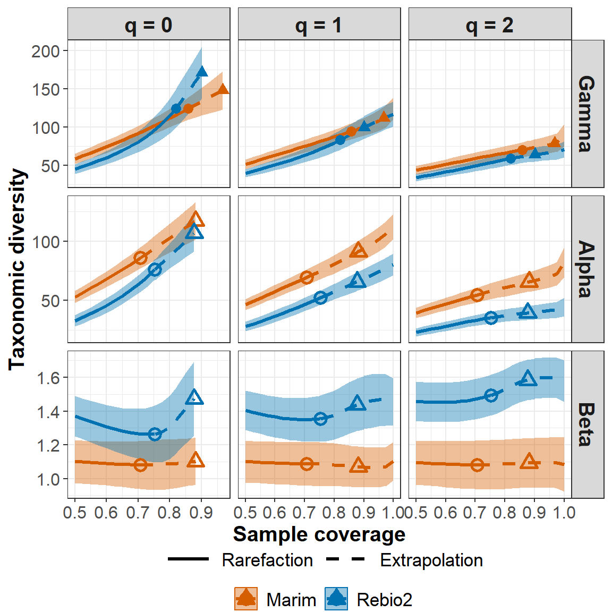
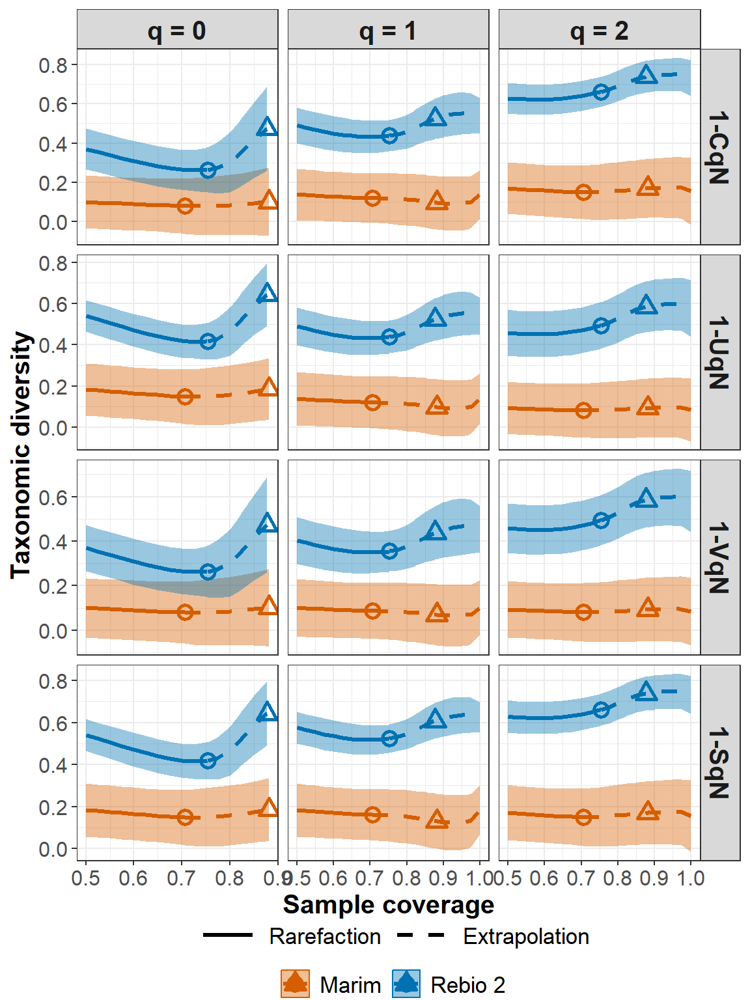
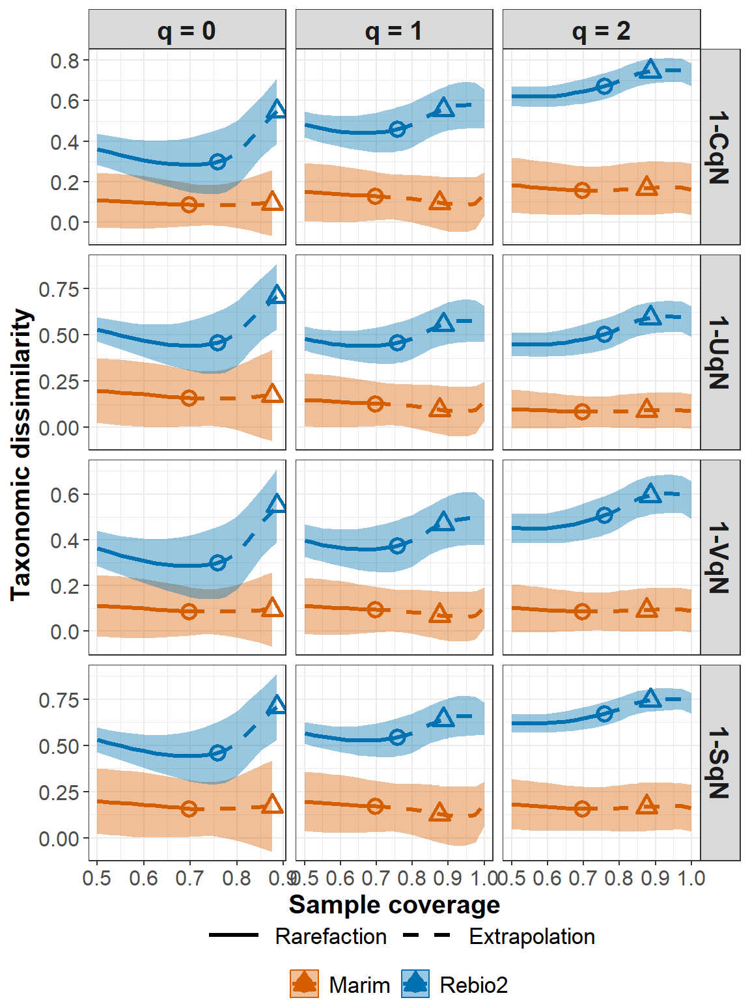

<!-- README.md is generated from README.Rmd. Please edit that file -->

# iNEXT.beta3D (R package)

<h5 align="right">
Latest version: 2023-08-05
</h5>
<font color="394CAE">
<h3 color="394CAE" style="font-weight: bold">
Introduction to iNEXT.beta3D (R package): Excerpt from iNEXT.beta3D
User’s Guide
</h3>
</font> <br>
<h5>
<b>Anne Chao, Kai-Hsiang Hu, Y.S. Kao and Z.C. Szu-tu</b> <br><br>
<i>Institute of Statistics, National Tsing Hua University, Hsin-Chu,
Taiwan 30043</i>
</h5>

<br> iNEXT.beta3D (iNterpolation and EXTrapolation for three dimensions
of Beta diversity) is an original R package available in
[Github](https://github.com/AnneChao). An online version of
[iNEXT.beta3D Online](https://chao.shinyapps.io/iNEXT_beta3D/) is also
available for users without an R background. Detailed information about
all functions in iNEXT.beta3D is provided in the iNEXT.beta3D Manual in
[iNEXT.beta3D_vignettes](http://chao.stat.nthu.edu.tw/wordpress/wp-content/uploads/software/A%20Quick%20Introduction%20to%20iNEXT.beta3D.html),
which is available from [Anne Chao’s
website](http://chao.stat.nthu.edu.tw/wordpress/software_download/).

`iNEXT.beta3D` focuses on Chiu’s et al.’s multiple assemblages
decomposition (Chiu et al., 2014) based on three measures of Hill
numbers of order q: species richness (`q = 0`), Shannon diversity
(`q = 1`, the exponential of Shannon entropy) and Simpson diversity
(`q = 2`, the inverse of Simpson concentration). Besides, `iNEXT.beta3D`
also promote phylogenetic diversity level and functional diversity level
(Chao et al., 2019). For each diversity measure, `iNEXT.beta3D` uses the
observed sample of abundance or incidence data (called the “reference
sample”) to compute diversity estimates and the associated 95%
confidence intervals for the following two types of rarefaction and
extrapolation (R/E):

1.  Sample-size-based (or size-based) R/E sampling curves:
    `iNEXT.beta3D` computes <font color=#FF6781>gamma and alpha</font>
    diversity estimates for rarefied and extrapolated samples up to an
    appropriate size. This type of sampling curve plots the diversity
    estimates with respect to sample size.

2.  Sample-coverage-based (or coverage-based) R/E sampling curves:
    `iNEXT.beta3D` computes <font color=#FF6781>gamma, alpha, and
    beta</font> diversity estimates and <font color=#FF6781>four
    dissimilarity</font> measures estimates for rarefied and
    extrapolated samples based on a standardized level of sample
    completeness (as measured by sample coverage) up to an appropriate
    coverage value. This type of sampling curve plots the diversity
    estimates with respect to sample coverage.

`iNEXT.beta3D` also plots the above two types of sampling curves for
gamma, alpha, and beta diversity and four dissimilarity-turnover.

### SOFTWARE NEEDED TO RUN iNEXT.beta3D IN R

-   Required: [R](http://cran.rstudio.com/)
-   Suggested: [RStudio IDE](http://www.rstudio.com/ide/download/)

## HOW TO RUN iNEXT.beta3D:

The `iNEXT.beta3D` package will be submitted to \[CRAN\] and can be
downloaded from Anne Chao’s
[iNEXT.beta3D_github](https://github.com/AnneChao/iNEXT.beta3D) using
the following commands. For a first-time installation, an additional
visualization extension package (`ggplot2`) and (`iNEXT.3D`) from Anne
Chao’s github must be installed and loaded.

``` r
# install_github('AnneChao/iNEXT.3D')
# library(iNEXT.3D)

## install iNEXT.beta3D package from CRAN
# install.packages("iNEXT.beta3D")  # coming soon

## install the latest version from github
install.packages('devtools')
library(devtools)
install_github('AnneChao/iNEXT.beta3D')

## import packages
library(iNEXT.beta3D)
```

Here are two main functions we provide in this package :

-   **iNEXTbeta3D** : Computing standardized gamma, alpha, beta
    diversity, and four dissimilarity-turnover indices for three
    dimensions: taxonomic, phylogenetic and functional diversity at
    specified sample coverage or sample size.

-   **ggiNEXTbeta3D** : Visualizing the output from the function
    `iNEXTbeta3D`.

### MAIN FUNCTION: iNEXTbeta3D()

We first describe the main function `iNEXTbeta3D()` with default
arguments:

``` r
iNEXTbeta3D(data, diversity = "TD", q = c(0, 1, 2), datatype = "abundance",
            base = "coverage", level = NULL, nboot = 20, conf = 0.95,
            PDtree = NULL, PDreftime = NULL, PDtype = "meanPD",
            FDdistM = NULL, FDtype = "AUC", FDtau = NULL, FDcut_number = 30)
```

The arguments of this function are briefly described below, and will be
explained in more details by illustrative examples in later text. This
main function computes gamma, alpha and beta diversity estimates of
order q at specified sample coverage or sample size and measures of
dissimilarity. <font color=#FF6781>By default of</font> <code>base =
“coverage”</code> and <code>level = NULL</code>, then this function
computes the gamma, alpha, beta diversity, and four
dissimilarity-turnover indices estimates up to one (for q = 1, 2) or up
to the coverage of double the reference sample size (for q = 0).
<font color=#FF6781>If</font> <code>base = “size”</code> and <code>level
= NULL</code>, then this function computes the gamma and alpha diversity
estimates up to double the reference sample size in each region.

<table class='gmisc_table' style='border-collapse: collapse; margin-top: 1em; margin-bottom: 1em;' >
<thead>
<tr>
<th style="font-weight: 900; border-bottom: 1px solid grey; border-top: 2px solid grey; text-align: center;">
Argument
</th>
<th style="font-weight: 900; border-bottom: 1px solid grey; border-top: 2px solid grey; text-align: center;">
Description
</th>
</tr>
</thead>
<tbody>
<tr>
<td style="text-align: left;">
data
</td>
<td style='text-align: left;'>

1.  For datatype = ‘abundance’, data can be input as a matrix/data.frame
    (species by assemblages), or a list of matrices/data.frames, each
    matrix represents species-by-assemblages abundance matrix.
2.  For datatype = ‘incidence_raw’ data can be input as a list (a
    region) with several lists (assemblages) of matrices/data.frames,
    each matrix represents species-by-sampling units.
    </td>
    </tr>
    <tr>
    <td style="text-align: left;">
    diversity
    </td>
    <td style="text-align: left;">
    selection of diversity type: ‘TD’ = Taxonomic diversity, ‘PD’ =
    Phylogenetic diversity, and ‘FD’ = Functional diversity.
    </td>
    </tr>
    <tr>
    <td style="text-align: left;">
    q
    </td>
    <td style="text-align: left;">
    a numerical vector specifying the diversity orders. Default is c(0,
    1, 2).
    </td>
    </tr>
    <tr>
    <td style="text-align: left;">
    datatype
    </td>
    <td style="text-align: left;">
    data type of input data: individual-based abundance data (datatype =
    ‘abundance’), sampling-unit-based incidence frequencies data
    (datatype = ‘incidence_freq’), or species by sampling-units
    incidence matrix (datatype = ‘incidence_raw’) with all entries being
    0 (non-detection) or 1 (detection).
    </td>
    </tr>
    <tr>
    <td style="text-align: left;">
    base
    </td>
    <td style="text-align: left;">
    Sample-sized-based rarefaction and extrapolation for gamma and alpha
    diversity (base = ‘size’) or coverage-based rarefaction and
    extrapolation for gamma, alpha and beta diversity (base =
    ‘coverage’). Default is base = ‘coverage’.
    </td>
    </tr>
    <tr>
    <td style="text-align: left;">
    level
    </td>
    <td style="text-align: left;">
    A numerical vector specifying the particular value of sample
    coverage (between 0 and 1 when base = ‘coverage’) or sample size
    (base = ‘size’). level = 1 (base = ‘coverage’) means complete
    coverage(the corresponding diversity represents asymptotic
    diversity). If base = ‘size’ and ‘level = NULL’, then this function
    computes the gamma and alpha diversity estimates up to double the
    reference sample size. If base = ‘coverage’ and ‘level = NULL’, then
    this function computes the gamma and alpha diversity estimates up to
    one (for ‘q = 1, 2’) or up to the coverage of double the reference
    sample size (for ‘q = 0’); the corresponding beta diversity is
    computed up to the same maximum coverage as the alpha diversity.
    </td>
    </tr>
    <tr>
    <td style="text-align: left;">
    nboot
    </td>
    <td style="text-align: left;">
    a positive integer specifying the number of bootstrap replications
    when assessing sampling uncertainty and constructing confidence
    intervals. Enter 0 to skip the bootstrap procedures. Default is 50.
    </td>
    </tr>
    <tr>
    <td style="text-align: left;">
    conf
    </td>
    <td style="text-align: left;">
    a positive number \< 1 specifying the level of confidence interval.
    Default is ‘0.95’.
    </td>
    </tr>
    <tr>
    <td style="text-align: left;">
    PDtree
    </td>
    <td style="text-align: left;">
    (required only when diversity = ‘PD’), a phylogenetic tree in Newick
    format for all observed species in the pooled assemblage.
    </td>
    </tr>
    <tr>
    <td style="text-align: left;">
    PDreftime
    </td>
    <td style="text-align: left;">
    (required only when diversity = ‘PD’), a vector of numerical values
    specifying reference times for PD. Default is NULL (i.e., the age of
    the root of PDtree).
    </td>
    </tr>
    <tr>
    <td style="text-align: left;">
    PDtype
    </td>
    <td style="text-align: left;">
    (required only when diversity = ‘PD’), select PD type: PDtype = ‘PD’
    (effective total branch length) or PDtype = ‘meanPD’ (effective
    number of equally divergent lineages). Default is ‘meanPD’, where
    meanPD = PD/tree depth.
    </td>
    </tr>
    <tr>
    <td style="text-align: left;">
    FDdistM
    </td>
    <td style="text-align: left;">
    (required only when diversity = ‘FD’), select FD type: FDtype =
    ‘tau_values’ for FD under specified threshold values, or FDtype =
    ‘AUC’ (area under the curve of tau-profile) for an overall FD which
    integrates all threshold values between zero and one. Default is
    ‘AUC’.
    </td>
    </tr>
    <tr>
    <td style="text-align: left;">
    FDtype
    </td>
    <td style="text-align: left;">
    (required only when diversity = ‘FD’), select FD type: FDtype =
    ‘tau_values’ for FD under specified threshold values, or FDtype =
    ‘AUC’ (area under the curve of tau-profile) for an overall FD which
    integrates all threshold values between zero and one. Default is
    ‘AUC’.
    </td>
    </tr>
    <tr>
    <td style="text-align: left;">
    FDtau
    </td>
    <td style="text-align: left;">
    (required only when diversity = ‘FD’ and FDtype = ‘tau_values’), a
    numerical vector between 0 and 1 specifying tau values (threshold
    levels). If NULL (default), then threshold is set to be the mean
    distance between any two individuals randomly selected from the
    pooled assemblage (i.e., quadratic entropy).
    </td>
    </tr>
    <tr>
    <td style="text-align: left;">
    details
    </td>
    <td style="text-align: left;">
    a logical variable to decide whether do you want to print out the
    detailed value for each plots, default is `FALSE`.
    </td>
    </tr>
    <tr>
    <td style="border-bottom: 2px solid grey; text-align: left;">
    FDcut_number
    </td>
    <td style="border-bottom: 2px solid grey; text-align: left;">
    (required only when diversity = ‘FD’ and FDtype = ‘AUC’), a numeric
    number to split zero to one into several equal-spaced length.
    Default is ‘30’.
    </td>
    </tr>
    </tbody>
    </table>

This function returns an `"iNEXTbeta3D"` object which can be further
used to make plots using the function `ggiNEXTbeta3D()` to be described
below.

## DATA FORMAT/INFORMATION

Two types of data are supported:

1.  Individual-based abundance data (`datatype = "abundance"`): Input
    data for each region with several assemblages/sites include samples
    species abundances in an empirical sample of n individuals
    (“reference sample”). When there are N assemblages in a region,
    input data consist of a list with an S by N abundance matrix; For M
    regions consisting N assemblages, input data should be
    <font color=#FF6781>a list of M S by N abundance matrices</font>.

2.  Sampling-unit-based incidence raw data
    (`datatype = "incidence_raw"`): Input data for a reference sample
    consist of a species-by-sampling-unit matrix; The number of sampling
    units and species for each assemblages in a region should be the
    same. For M regions consisting N assemblages, input data should be
    <font color=#FF6781>a list of M lists each consists of N
    species-by-sampling-unit matrices</font>.

Two data sets ( Brazil rain-forests under different habitats for
abundance data and Beetles under different time periods for incidence
raw data ) are included in `iNEXT.beta3D` package for illustration. For
abundance data, the Brazil rain-forests data consist a list of twelve
matrices (here we use two sites “Marim” and “Edge” for computing). Each
matrix represents a species-by-habitat (“Edge” and “Interior”) in a
site. For incidence raw data, the beetles data consist two lists
(“unlogged” and “logged”). For each list, it has two matrices (each
means year 2008 and 2009) which represent species-by-sampling units
assemblages. For these data, the following commands display how to
compute taxonomic, phylogenetic and functional beta decomposition and
dissimilarities at specified sample coverage for abundance and incidence
raw data respectively.

Run the following code to view Brazil rain-forests abundance data: (Here
we only show the first ten rows for each matrix)

``` r
data("Brazil_data")
Brazil_data
```

    $Caliman
                                                               Edge Interior
    Abarema cochliacarpos (B.A.Gomes) Barneby & J.W.Grimes        0        0
    Acacia glomerosa Benth.                                       0        0
    Acosmium lentiscifolium Spreng.                               0        0
    Actinostemon concolor (Spreng.) Mull. Arg.                    0        1
    Actinostemon estrellensis (Mull. Arg.) var. latifolius Pax    0        0
    Aegiphila verticillata Vell.                                  0        0
    Albizia pedicellaris ( DC. ) Barneby & J.W.Grimes             0        0
    Albizia polycephala (Benth.) Killip                           1        0
    Alchornea sidifolia Klotzch.                                  0        0
    Allophylus petiolulatus Radlk.                                2        0

    $`Fibria(g)`
                                                               Edge Interior
    Abarema cochliacarpos (B.A.Gomes) Barneby & J.W.Grimes        0        0
    Acacia glomerosa Benth.                                       0        0
    Acosmium lentiscifolium Spreng.                               1        0
    Actinostemon concolor (Spreng.) Mull. Arg.                    0        0
    Actinostemon estrellensis (Mull. Arg.) var. latifolius Pax    1        0
    Aegiphila verticillata Vell.                                  0        0
    Albizia pedicellaris ( DC. ) Barneby & J.W.Grimes             0        0
    Albizia polycephala (Benth.) Killip                           0        0
    Alchornea sidifolia Klotzch.                                  0        0
    Allophylus petiolulatus Radlk.                                6        0

    $`Fibria(p)`
                                                               Edge Interior
    Abarema cochliacarpos (B.A.Gomes) Barneby & J.W.Grimes        0        0
    Acacia glomerosa Benth.                                       0        0
    Acosmium lentiscifolium Spreng.                               0        0
    Actinostemon concolor (Spreng.) Mull. Arg.                    0        0
    Actinostemon estrellensis (Mull. Arg.) var. latifolius Pax    0        0
    Aegiphila verticillata Vell.                                  0        0
    Albizia pedicellaris ( DC. ) Barneby & J.W.Grimes             0        0
    Albizia polycephala (Benth.) Killip                           0        1
    Alchornea sidifolia Klotzch.                                  0        2
    Allophylus petiolulatus Radlk.                                2        1

    $Marim
                                                               Edge Interior
    Abarema cochliacarpos (B.A.Gomes) Barneby & J.W.Grimes        0        0
    Acacia glomerosa Benth.                                       0        0
    Acosmium lentiscifolium Spreng.                               1        0
    Actinostemon concolor (Spreng.) Mull. Arg.                    0        0
    Actinostemon estrellensis (Mull. Arg.) var. latifolius Pax    0        0
    Aegiphila verticillata Vell.                                  0        0
    Albizia pedicellaris ( DC. ) Barneby & J.W.Grimes             0        0
    Albizia polycephala (Benth.) Killip                           0        0
    Alchornea sidifolia Klotzch.                                  0        0
    Allophylus petiolulatus Radlk.                                5        0

    $NEB
                                                               Edge Interior
    Abarema cochliacarpos (B.A.Gomes) Barneby & J.W.Grimes        0        0
    Acacia glomerosa Benth.                                      10        0
    Acosmium lentiscifolium Spreng.                               0        0
    Actinostemon concolor (Spreng.) Mull. Arg.                    0        0
    Actinostemon estrellensis (Mull. Arg.) var. latifolius Pax    2        8
    Aegiphila verticillata Vell.                                  0        0
    Albizia pedicellaris ( DC. ) Barneby & J.W.Grimes             0        0
    Albizia polycephala (Benth.) Killip                           5        0
    Alchornea sidifolia Klotzch.                                  0        0
    Allophylus petiolulatus Radlk.                                6        0

    $`Rebio 1`
                                                               Edge Interior
    Abarema cochliacarpos (B.A.Gomes) Barneby & J.W.Grimes        0        0
    Acacia glomerosa Benth.                                       5        1
    Acosmium lentiscifolium Spreng.                               2        2
    Actinostemon concolor (Spreng.) Mull. Arg.                    0        0
    Actinostemon estrellensis (Mull. Arg.) var. latifolius Pax    0        0
    Aegiphila verticillata Vell.                                  0        0
    Albizia pedicellaris ( DC. ) Barneby & J.W.Grimes             0        0
    Albizia polycephala (Benth.) Killip                           3        1
    Alchornea sidifolia Klotzch.                                  0        0
    Allophylus petiolulatus Radlk.                                4        1

    $`Rebio 2`
                                                               Edge Interior
    Abarema cochliacarpos (B.A.Gomes) Barneby & J.W.Grimes        0        0
    Acacia glomerosa Benth.                                       0        0
    Acosmium lentiscifolium Spreng.                               0        0
    Actinostemon concolor (Spreng.) Mull. Arg.                    0        0
    Actinostemon estrellensis (Mull. Arg.) var. latifolius Pax    0        0
    Aegiphila verticillata Vell.                                  0        0
    Albizia pedicellaris ( DC. ) Barneby & J.W.Grimes             0        0
    Albizia polycephala (Benth.) Killip                           1        0
    Alchornea sidifolia Klotzch.                                  0        0
    Allophylus petiolulatus Radlk.                                3        3

    $`Rebio 3`
                                                               Edge Interior
    Abarema cochliacarpos (B.A.Gomes) Barneby & J.W.Grimes        0        0
    Acacia glomerosa Benth.                                       0        0
    Acosmium lentiscifolium Spreng.                               2        0
    Actinostemon concolor (Spreng.) Mull. Arg.                    0        0
    Actinostemon estrellensis (Mull. Arg.) var. latifolius Pax    0        0
    Aegiphila verticillata Vell.                                  0        1
    Albizia pedicellaris ( DC. ) Barneby & J.W.Grimes             0        0
    Albizia polycephala (Benth.) Killip                           1        0
    Alchornea sidifolia Klotzch.                                  0        0
    Allophylus petiolulatus Radlk.                                2        0

    $`RNV(c)`
                                                               Edge Interior
    Abarema cochliacarpos (B.A.Gomes) Barneby & J.W.Grimes        0        0
    Acacia glomerosa Benth.                                       0        0
    Acosmium lentiscifolium Spreng.                               0        0
    Actinostemon concolor (Spreng.) Mull. Arg.                    0        0
    Actinostemon estrellensis (Mull. Arg.) var. latifolius Pax    0        0
    Aegiphila verticillata Vell.                                  0        0
    Albizia pedicellaris ( DC. ) Barneby & J.W.Grimes             1        0
    Albizia polycephala (Benth.) Killip                           0        0
    Alchornea sidifolia Klotzch.                                  0        0
    Allophylus petiolulatus Radlk.                                0        0

    $`RNV(p)`
                                                               Edge Interior
    Abarema cochliacarpos (B.A.Gomes) Barneby & J.W.Grimes        0        1
    Acacia glomerosa Benth.                                       2        0
    Acosmium lentiscifolium Spreng.                               2        0
    Actinostemon concolor (Spreng.) Mull. Arg.                    0        0
    Actinostemon estrellensis (Mull. Arg.) var. latifolius Pax    1       17
    Aegiphila verticillata Vell.                                  0        0
    Albizia pedicellaris ( DC. ) Barneby & J.W.Grimes             0        0
    Albizia polycephala (Benth.) Killip                           3        0
    Alchornea sidifolia Klotzch.                                  0        0
    Allophylus petiolulatus Radlk.                                9        3

    $Rochedo
                                                               Edge Interior
    Abarema cochliacarpos (B.A.Gomes) Barneby & J.W.Grimes        0        0
    Acacia glomerosa Benth.                                       0        0
    Acosmium lentiscifolium Spreng.                               0        1
    Actinostemon concolor (Spreng.) Mull. Arg.                    0        0
    Actinostemon estrellensis (Mull. Arg.) var. latifolius Pax   23       27
    Aegiphila verticillata Vell.                                  0        0
    Albizia pedicellaris ( DC. ) Barneby & J.W.Grimes             0        0
    Albizia polycephala (Benth.) Killip                           3        0
    Alchornea sidifolia Klotzch.                                  0        0
    Allophylus petiolulatus Radlk.                                5        0

    $Xerxes
                                                               Edge Interior
    Abarema cochliacarpos (B.A.Gomes) Barneby & J.W.Grimes        0        0
    Acacia glomerosa Benth.                                       0        0
    Acosmium lentiscifolium Spreng.                               0        3
    Actinostemon concolor (Spreng.) Mull. Arg.                    0        0
    Actinostemon estrellensis (Mull. Arg.) var. latifolius Pax    0        0
    Aegiphila verticillata Vell.                                  0        0
    Albizia pedicellaris ( DC. ) Barneby & J.W.Grimes             0        0
    Albizia polycephala (Benth.) Killip                           1        0
    Alchornea sidifolia Klotzch.                                  0        0
    Allophylus petiolulatus Radlk.                                1        0

Run the following code to view Beetles incidence raw data: (Here we only
show the first ten rows and six columns for each matrix)

``` r
data("beetle_inc")
beetle_abu
```

    $`2008 vs. 2009 unlogged`
    $`2008 vs. 2009 unlogged`[[1]]
                          2008FKN_17 2008LAO_10 2008LAO_12 2008LAO_13 2008LAO_14 2008LAO_5
    Abdera_flexuosa                0          0          0          0          0         0
    Onyxacalles_pyrenaeus          0          0          0          0          0         0
    Acanthocinus_griseus           0          0          0          0          0         0
    Agathidium_nigripenne          0          0          0          0          0         0
    Ampedus_aethiops               0          1          1          1          0         0
    Ampedus_auripes                0          1          1          1          1         0
    Ampedus_balteatus              0          0          0          0          1         0
    Ampedus_erythrogonus           0          0          0          0          0         0
    Ampedus_melanurus              0          0          0          0          0         0
    Ampedus_nigrinus               0          1          1          0          1         0

    $`2008 vs. 2009 unlogged`[[2]]
                          2009FKN_17 2009LAO_10 2009LAO_12 2009LAO_13 2009LAO_14 2009LAO_5
    Abdera_flexuosa                0          0          0          0          0         0
    Onyxacalles_pyrenaeus          0          0          0          0          0         0
    Acanthocinus_griseus           0          0          0          0          0         0
    Agathidium_nigripenne          0          0          0          0          0         0
    Ampedus_aethiops               0          1          0          0          0         0
    Ampedus_auripes                0          1          1          1          1         0
    Ampedus_balteatus              0          1          0          0          0         0
    Ampedus_erythrogonus           0          0          0          0          0         0
    Ampedus_melanurus              0          0          0          0          0         0
    Ampedus_nigrinus               0          1          1          1          1         0


    $`2008 vs. 2009 logged`
    $`2008 vs. 2009 logged`[[1]]
                          2008FAE_1 2008FAE_11 2008FAE_16 2008FAE_18 2008FAE_2 2008FAE_21
    Abdera_flexuosa               0          0          0          0         0          0
    Onyxacalles_pyrenaeus         0          0          0          0         0          0
    Acanthocinus_griseus          0          0          0          0         0          0
    Agathidium_nigripenne         0          0          0          0         0          0
    Ampedus_aethiops              0          0          1          1         1          1
    Ampedus_auripes               0          0          1          1         1          1
    Ampedus_balteatus             0          1          1          1         0          1
    Ampedus_erythrogonus          0          0          0          0         0          0
    Ampedus_melanurus             0          0          0          0         0          0
    Ampedus_nigrinus              0          1          1          1         1          1

    $`2008 vs. 2009 logged`[[2]]
                          2009FAE_1 2009FAE_11 2009FAE_16 2009FAE_18 2009FAE_2 2009FAE_21
    Abdera_flexuosa               0          0          0          0         0          0
    Onyxacalles_pyrenaeus         0          0          0          0         0          0
    Acanthocinus_griseus          0          0          0          0         0          0
    Agathidium_nigripenne         0          0          0          0         0          0
    Ampedus_aethiops              0          0          1          1         0          1
    Ampedus_auripes               0          0          0          1         0          0
    Ampedus_balteatus             0          1          1          0         0          1
    Ampedus_erythrogonus          0          1          0          0         1          0
    Ampedus_melanurus             0          0          0          0         0          0
    Ampedus_nigrinus              0          1          1          1         1          1

## Rarefaction/Extrapolation Via Examples

#### Output of iNEXTbeta3D()

When `base = 'coverage'`, the `iNEXTbeta3D()` function returns the
`"iNEXTbeta3D"` object including seven data frames for each regions:

-   gamma ( gamma diversity )
-   alpha ( alpha diversity )
-   beta ( beta diversity )
-   C ( Sorensen-type non-overlap )
-   U ( Jaccard-type non-overlap )
-   V ( Sorensen-type turnover )
-   S ( Jaccard-type turnover )

When `base = 'size'`, the `iNEXTbeta3D()` function returns the
`"iNEXTbeta3D"` object including two data frames for each regions:

-   gamma ( gamma diversity )
-   alpha ( alpha diversity )

## Taxonomic Diversity

First, we run the `iNEXTbeta3D()` function with Brazil rain-forests
abundance data to compute standardized gamma, alpha, beta diversity, and
four dissimilarities under `base = 'coverage'`. (Here we only show the
first six outputs for each output in region “Marim”)

``` r
data("Brazil_data")

# Taxonomic diversity
Abundance_TD = iNEXTbeta3D(data = Brazil_data[c('Marim', 'Rebio 2')], diversity = 'TD', datatype = "abundance", 
                           base = 'coverage', nboot = 100)
Abundance_TD
```

    $gamma
      Estimate Order.q      Method    SC   Size  s.e.    LCL    UCL Region diversity
    1   58.408       0 Rarefaction 0.500 83.059 3.262 52.015 64.801  Marim        TD
    2   51.347       1 Rarefaction 0.500 83.059 2.971 45.524 57.169  Marim        TD
    3   43.332       2 Rarefaction 0.500 83.059 2.775 37.892 48.772  Marim        TD
    4   62.187       0 Rarefaction 0.525 90.787 3.417 55.490 68.883  Marim        TD
    5   54.203       1 Rarefaction 0.525 90.787 3.092 48.143 60.262  Marim        TD
    6   45.322       2 Rarefaction 0.525 90.787 2.893 39.652 50.992  Marim        TD

    $alpha
      Estimate Order.q      Method    SC    Size  s.e.    LCL    UCL Region diversity
    1   53.071       0 Rarefaction 0.500 151.449 3.202 46.795 59.346  Marim        TD
    2   46.661       1 Rarefaction 0.500 151.449 2.917 40.943 52.379  Marim        TD
    3   39.619       2 Rarefaction 0.500 151.449 2.709 34.310 44.928  Marim        TD
    4   56.626       0 Rarefaction 0.525 166.013 3.359 50.041 63.210  Marim        TD
    5   49.339       1 Rarefaction 0.525 166.013 3.036 43.388 55.290  Marim        TD
    6   41.513       2 Rarefaction 0.525 166.013 2.821 35.984 47.041  Marim        TD

    $beta
      Estimate Order.q      Method    SC    Size  s.e.   LCL   UCL Region diversity
    1    1.101       0 Rarefaction 0.500 151.449 0.065 0.974 1.227  Marim        TD
    2    1.100       1 Rarefaction 0.500 151.449 0.060 0.983 1.217  Marim        TD
    3    1.094       2 Rarefaction 0.500 151.449 0.058 0.981 1.207  Marim        TD
    4    1.098       0 Rarefaction 0.525 166.013 0.066 0.970 1.227  Marim        TD
    5    1.099       1 Rarefaction 0.525 166.013 0.060 0.981 1.216  Marim        TD
    6    1.092       2 Rarefaction 0.525 166.013 0.058 0.978 1.205  Marim        TD

    $C
      Estimate Order.q      Method    SC    Size  s.e.    LCL   UCL Region diversity
    1    0.101       0 Rarefaction 0.500 151.449 0.065 -0.026 0.227  Marim        TD
    2    0.138       1 Rarefaction 0.500 151.449 0.059  0.022 0.254  Marim        TD
    3    0.171       2 Rarefaction 0.500 151.449 0.057  0.059 0.284  Marim        TD
    4    0.098       0 Rarefaction 0.525 166.013 0.066 -0.030 0.227  Marim        TD
    5    0.136       1 Rarefaction 0.525 166.013 0.059  0.020 0.252  Marim        TD
    6    0.168       2 Rarefaction 0.525 166.013 0.058  0.055 0.281  Marim        TD

    $U
      Estimate Order.q      Method    SC    Size  s.e.    LCL   UCL Region diversity
    1    0.183       0 Rarefaction 0.500 151.449 0.059  0.066 0.299  Marim        TD
    2    0.138       1 Rarefaction 0.500 151.449 0.059  0.022 0.254  Marim        TD
    3    0.094       2 Rarefaction 0.500 151.449 0.058 -0.019 0.207  Marim        TD
    4    0.179       0 Rarefaction 0.525 166.013 0.060  0.061 0.297  Marim        TD
    5    0.136       1 Rarefaction 0.525 166.013 0.059  0.020 0.252  Marim        TD
    6    0.092       2 Rarefaction 0.525 166.013 0.058 -0.022 0.205  Marim        TD

    $V
      Estimate Order.q      Method    SC    Size  s.e.    LCL   UCL Region diversity
    1    0.101       0 Rarefaction 0.500 151.449 0.065 -0.026 0.227  Marim        TD
    2    0.100       1 Rarefaction 0.500 151.449 0.060 -0.017 0.217  Marim        TD
    3    0.094       2 Rarefaction 0.500 151.449 0.058 -0.019 0.207  Marim        TD
    4    0.098       0 Rarefaction 0.525 166.013 0.066 -0.030 0.227  Marim        TD
    5    0.099       1 Rarefaction 0.525 166.013 0.060 -0.019 0.216  Marim        TD
    6    0.092       2 Rarefaction 0.525 166.013 0.058 -0.022 0.205  Marim        TD

    $S
      Estimate Order.q      Method    SC    Size  s.e.   LCL   UCL Region diversity
    1    0.183       0 Rarefaction 0.500 151.449 0.059 0.066 0.299  Marim        TD
    2    0.183       1 Rarefaction 0.500 151.449 0.056 0.072 0.293  Marim        TD
    3    0.171       2 Rarefaction 0.500 151.449 0.057 0.059 0.284  Marim        TD
    4    0.179       0 Rarefaction 0.525 166.013 0.060 0.061 0.297  Marim        TD
    5    0.179       1 Rarefaction 0.525 166.013 0.056 0.069 0.290  Marim        TD
    6    0.168       2 Rarefaction 0.525 166.013 0.058 0.055 0.281  Marim        TD

The output contains seven data frames: `gamma`, `alpha`, `beta`, `C`,
`U`, `V`, `S`. For each data frame, it includes the diversity estimate
(`Estimate`), the diversity order (`Order.q`), `Method` (Interpolated,
Observed, or Extrapolated, depending on whether the size `m` is less
than, equal to, or greater than the reference sample size), the sample
coverage estimate (`SC`), the sample size (`Size`), the standard error
from bootstrap replications (`s.e.`), the 95% lower and upper confidence
limits of diversity (`LCL`, `UCL`), and the name of region (`Region`).
These diversity estimates with confidence intervals are used for
plotting the diversity curve.

Then, we can also use beetles incidence raw data to compute standardized
gamma, alpha, beta diversity, and four dissimilarities under
`base = 'coverage'`. (Here we don’t show the output)

``` r
data("beetle_inc")

Incidence_TD = iNEXTbeta3D(data = beetle_inc, diversity = 'TD', datatype = "incidence_raw",
                           base = 'coverage', nboot = 30)
Incidence_TD
```

## Phylogenetic Diversity

We can compute standardized gamma, alpha, beta diversity under
phylogenetic level with newick format data (`beetle_tree`). Here,
`PDtree` is the essential setting, and user can select `PDtype` and
`PDreftime` alternatively. `PDtype` has two selection: `"PD"` (effective
total branch length) or `"meanPD"` (effective number of equally
divergent lineages). `PDreftime` means a numerical value specifying
reference time for computing phylogenetic diversity. If
`PDreftime = NULL`, then it is set the reference time to the age of the
root of PDtree. (Here we don’t show the output)

``` r
## Phylogenetic diversity
# Abundance data
data("Brazil_PDFD_data")
data("Brazil_tree")

Abundance_PD = iNEXTbeta3D(data = Brazil_PDFD_data[c('Marim', 'Rebio 2')], diversity = 'PD', datatype = "abundance", 
                           base = 'coverage', nboot = 10, PDtree = Brazil_tree)
Abundance_PD


# Incidence data
data("beetle_inc")
data("beetle_tree")

Incidence_PD = iNEXTbeta3D(data = beetle_inc, diversity = 'PD', datatype = "incidence_raw", 
                           base = 'coverage', nboot = 30, PDtree = beetle_tree)
Incidence_PD
```

## Functional diversity

We can compute standardized gamma, alpha, beta diversity under
functional level with distance matrix (`beetle_distM`). Here, `FDdistM`
is the essential setting, and user can select `FDtype`, `FDtau`, and
`FDcut_number` alternatively. `FDtype` has two selections: “tau_value”
means compute functional diversity under a specific threshold value and
“AUC” means compute functional diversity by integrating all threshold
values between zero and one. If user selects `FDtype = "tau_value"`, it
need to input a `FD_tau` threshold value. If `FD_tau = NULL`, then it is
set to be the mean distance between any two individuals randomly
selected from the pooled assemblage (i.e., quadratic entropy). (Here we
don’t show the output)

``` r
## Functional diversity - under specified threshold
# Abundance data
data("Brazil_PDFD_data")
data("Brazil_distM")

Abundance_FDtau = iNEXTbeta3D(data = Brazil_PDFD_data[c('Marim', 'Rebio 2')], diversity = 'FD', 
                              datatype = "abundance", base = 'coverage', nboot = 30, 
                              FDdistM = Brazil_distM, FDtype = 'tau_value')
Abundance_FDtau


# Incidence data
data("beetle_inc")
data("beetle_distM")

Incidence_FDtau = iNEXTbeta3D(data = beetle_inc, diversity = 'FD', datatype = "incidence_raw", 
                              base = 'coverage', nboot = 30, 
                              FDdistM = beetle_distM, FDtype = 'tau_value')
Incidence_FDtau


## Functional diversity - area under curve (integrates all threshold values between zero and one)
# Abundance data
Abundance_FDAUC = iNEXTbeta3D(data = Brazil_PDFD_data[c('Marim', 'Rebio 2')], diversity = 'FD', 
                              datatype = "abundance", base = 'coverage', nboot = 30, 
                              FDdistM = Brazil_distM, FDtype = 'AUC')
Abundance_FDAUC


# Incidence data
Incidence_FDAUC = iNEXTbeta3D(data = beetle_inc, diversity = 'FD', datatype = "incidence_raw", 
                              base = 'coverage', nboot = 30, 
                              FDdistM = beetle_distM, FDtype = 'AUC')
Incidence_FDAUC
```

## GRAPHIC DISPLAYS: FUNCTION ggiNEXTbeta3D()

The function `ggiNEXTbeta3D()`, which extends `ggplot2` to the
`"iNEXTbeta3D"` object with default arguments, is described as follows:

``` r
ggiNEXTbeta3D(output, type = "B", scale = "free", transp = 0.4)  
```

<table class="gmisc_table" style="border-collapse: collapse; margin-top: 1em; margin-bottom: 1em;">
<thead>
<tr>
<th style="font-weight: 900; border-bottom: 1px solid grey; border-top: 2px solid grey; text-align: center;">
Argument
</th>
<th style="font-weight: 900; border-bottom: 1px solid grey; border-top: 2px solid grey; text-align: center;">
Description
</th>
</tr>
</thead>
<tbody>
<tr>
<td style="text-align: left;">
output
</td>
<td style="text-align: left;">
</td>
</tr>
<tr>
<td style="text-align: left;">
type
</td>
<td style="text-align: left;">
(required only when base = ‘coverage’), selection of plot type : type =
‘B’ for plotting the gamma, alpha, and beta diversity ; type = ‘D’ for
plotting 4 turnover dissimilarities.
</td>
</tr>
<tr>
<td style="text-align: left;">
scale
</td>
<td style="text-align: left;">
Are scales shared across all facets (the default, ‘fixed’), or do they
vary across rows (‘free_x’), columns (‘free_y’), or both rows and
columns (‘free’)? Default is ‘free’.
</td>
</tr>
<tr>
<td style="border-bottom: 2px solid grey; text-align: left;">
transp
</td>
<td style="border-bottom: 2px solid grey; text-align: left;">
a value between 0 and 1 controlling transparency. ‘transp = 0’ is
completely transparent, default is ‘0.4’.
</td>
</tr>
</tbody>
</table>

The `ggiNEXTbeta3D()` function is a wrapper around the `ggplot2` package
to create a R/E curve using a single line of code. The resulting object
is of class `"ggplot"`, so it can be manipulated using the `ggplot2`
tools. Users can visualize the output of beta diversity or four
dissimilarities by setting the parameter <code>**type**</code>:

``` r
Abundance_TD = iNEXTbeta3D(data = Brazil_data[c('Marim', 'Rebio 2')], diversity = 'TD', datatype = 'abundance', 
                           base = "coverage", nboot = 30, conf = 0.95)
ggiNEXTbeta3D(Abundance_TD, type = 'B')
```



``` r
ggiNEXTbeta3D(Abundance_TD, type = 'D')
```



The following commands return the size-based R/E sampling curves for
gamma and alpha taxonomic diversity:

``` r
output = iNEXTbeta3D(data = Brazil_data[c('Marim', 'Rebio 2')], diversity = 'TD', datatype = 'abundance', 
                     base = "size", nboot = 30, conf = 0.95)
ggiNEXTbeta3D(output)
```



## HOW TO CITE iNEXT.beta3D

If you publish your work based on the results from the `iNEXT.beta3D`
package, you should make references to the following methodology paper:

-   Chao, A., Thorn, S., Chiu, C.-H., Moyes, F., Hu, K.-H., Chazdon, R.
    L., Wu, J., Dornelas, M., Zelen??, D., Colwell, R. K., and
    Magurran, A. E. (2023). Rarefaction and extrapolation with beta
    diversity under a framework of Hill numbers: the iNEXT.beta3D
    standardization. <i>Ecological Monographs</i>, e1588.

## License

The iNEXT.beta3D package is licensed under the GPLv3. To help refine
`iNEXT.beta3D`, your comments or feedback would be welcome (please send
them to Anne Chao or report an issue on the iNEXT.beta3D github
[iNEXT.beta3D_github](https://github.com/AnneChao/iNEXT.beta3D).

## References

-   Chiu, C.-H., Jost, L. and Chao\*, A. (2014). Phylogenetic beta
    diversity, similarity, and differentiation measures based on Hill
    numbers. Ecological Monographs 84, 21-44.

-   Chao, A., Chiu, C.-H., Vill??ger, S., Sun, I.-F., Thorn, S., Lin,
    Y.-C., Chiang, J. M. and Sherwin, W. B. (2019). An
    attribute-diversity approach to functional diversity, functional
    beta diversity, and related (dis)similarity measures. Ecological
    Monographs, 89, e01343. 10.1002/ecm.1343.

-   Chao, A., Thorn, S., Chiu, C.-H., Moyes, F., Hu, K.-H., Chazdon, R.
    L., Wu, J., Dornelas, M., Zelen??, D., Colwell, R. K., and
    Magurran, A. E. (2023). Rarefaction and extrapolation with beta
    diversity under a framework of Hill numbers: the iNEXT.beta3D
    standardization. <i>Ecological Monographs</i>, e1588.
