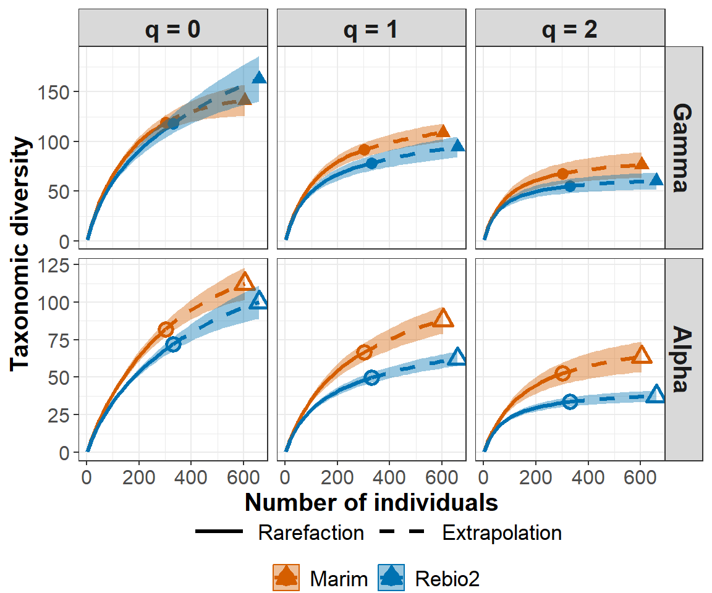
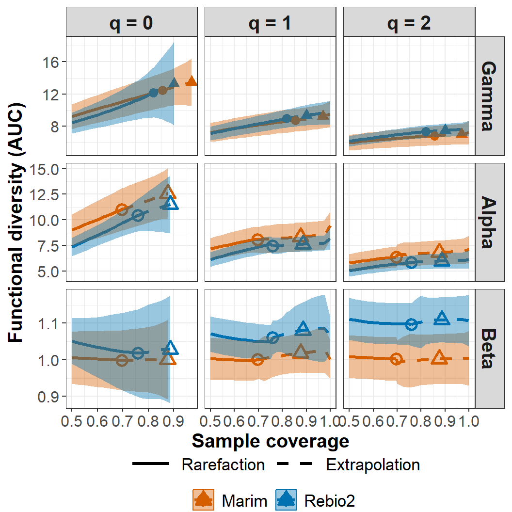
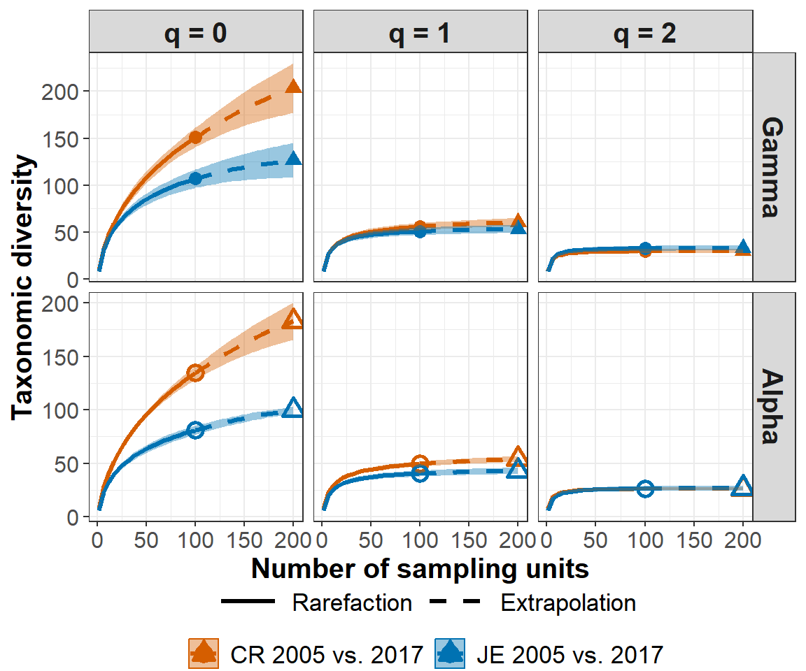
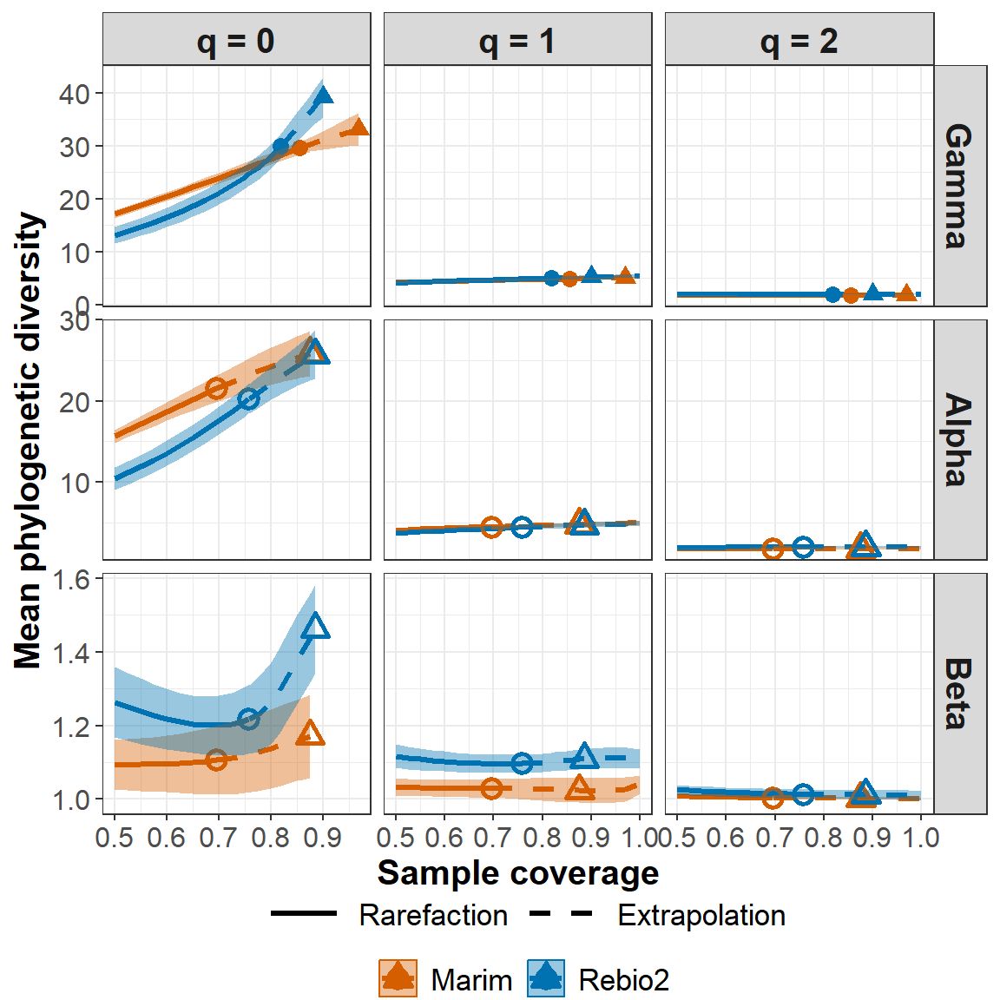
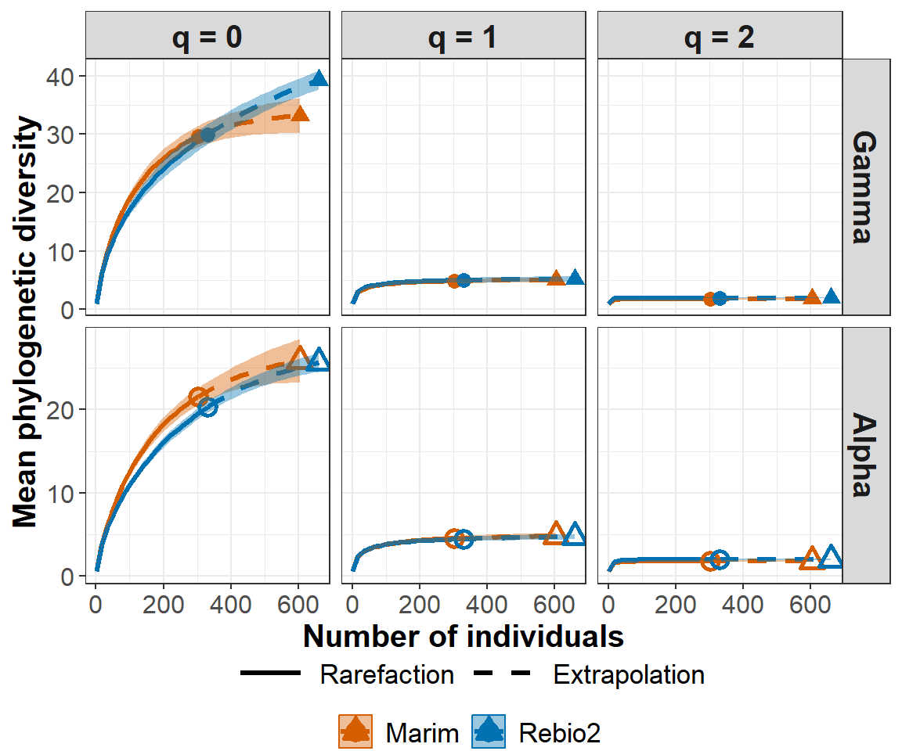
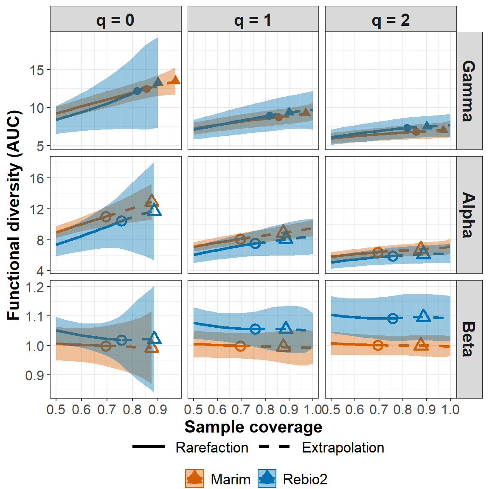
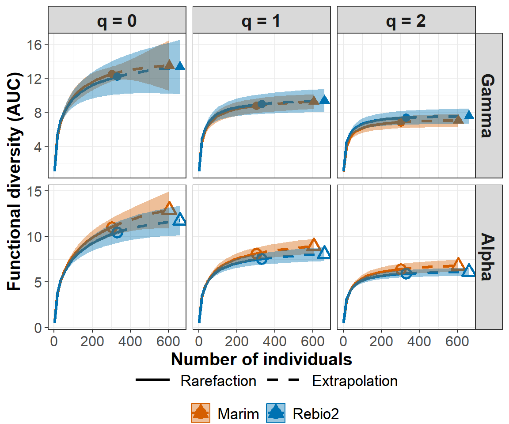

<!-- README.md is generated from README.Rmd. Please edit that file -->

# iNEXT.beta3D (R package)

<h5 align="right">
Latest version: 2024-02-22
</h5>
<font color="394CAE">
<h3 color="394CAE" style="font-weight: bold">
An Introduction to iNEXT.beta3D via Examples
</h3>
</font> <br>
<h5>
<b>Anne Chao and Kai-Hsiang Hu</b> <br><br> <i>Institute of Statistics,
National Tsing Hua University, Hsin-Chu, Taiwan 30043</i>
</h5>

<br> The package `iNEXT.beta3D` (iNterpolation and EXTrapolation with
beta diversity for three dimensions of biodiversity) is a sequel to
iNEXT. The three dimensions (3D) of biodiversity include “taxonomic
diversity” (TD), “phylogenetic diversity” (PD) and “functional
diversity” (FD). This document provides an introduction demonstrating
how to run `iNEXT.beta3D`. An online version [iNEXT.beta3D
Online](https://chao.shinyapps.io/iNEXT_beta3D/) is also available for
users without an R background.

A unified framework based on Hill numbers and their generalizations is
adopted to quantify TD, PD and FD. TD quantifies the effective number of
species, mean-PD (PD divided by tree depth) quantifies the effective
number of lineages, and FD quantifies the effective number of virtual
functional groups (or functional “species”). Thus, TD, mean-PD, and FD
are all in the same units of species/lineage equivalents and can be
meaningfully compared; see Chao et al. (2021) for a review of the
unified framework.

For each of the three dimensions, `iNEXT.beta3D` focuses on the
multiplicative diversity decomposition (alpha, beta and gamma) of orders
q = 0, 1 and 2 based on sampling data. Beta diversity quantifies the
extent of among-assemblage differentiation, or the changes in
species/lineages/functional-groups composition and abundance among
assemblages. `iNEXT.beta3D` features standardized 3D estimates with a
common sample size (for alpha and gamma diversity) or sample coverage
(for alpha, beta and gamma diversity). `iNEXT.beta3D` also features
coverage-based standardized estimates of four classes of dissimilarity
measures.

Based on the rarefaction and extrapolation (R/E) method for Hill numbers
(TD) of orders q = 0, 1 and 2, Chao et al. (2023b) developed the
pertinent R/E theory for taxonomic beta diversity with applications to
real-world spatial, temporal and spatio-temporal data. An application to
Gentry’s global forest data along with a concise description of the
theory is provided in Chao et al. (2023a). The extension to phylogenetic
and functional beta diversity is generally parallel.

The `iNEXT.beta3D` package features two types of R/E sampling curves:

1.  Sample-size-based (or size-based) R/E sampling curves: This type of
    sampling curve plots standardized 3D gamma and alpha diversity with
    respect to sample size. Note that the size-based beta diversity is
    not a statistically valid measure (Chao et al. 2023b) and thus the
    corresponding sampling curve is not provided.

2.  Sample-coverage-based (or coverage-based) R/E sampling curves: This
    type of sampling curve plots standardized 3D gamma, alpha, and beta
    diversity as well as four classes of dissimilarity measures with
    respect to sample coverage (an objective measure of sample
    completeness).

Sufficient data are needed to run `iNEXT.beta3D`. If your data comprise
only a few species and their abundances/phylogenies/traits, it is
probable that the data lack sufficient information to run
`iNEXT.beta3D`.

## HOW TO CITE iNEXT.beta3D

If you publish your work based on results from `iNEXT.beta3D`, you
should make reference to at least one of the following methodology
papers (2023a, b) and also cite the `iNEXT.beta3D` package:

-   Chao, A., Chiu, C.-H., Hu, K.-H., and Zeleny, D. (2023a). Revisiting
    Alwyn H. Gentry’s forest transect data: a statistical
    sampling-model-based approach. <i>Japanese Journal of Statistics and
    Data Science</i>, 6, 861-884.
    (<https://doi.org/10.1007/s42081-023-00214-1>)

-   Chao, A., Thorn, S., Chiu, C.-H., Moyes, F., Hu, K.-H., Chazdon, R.
    L., Wu, J., Magnago, L. F. S., Dornelas, M., Zeleny, D., Colwell, R.
    K., and Magurran, A. E. (2023b). Rarefaction and extrapolation with
    beta diversity under a framework of Hill numbers: the iNEXT.beta3D
    standardization. <i>Ecological Monographs</i>
    e1588.(<https://doi.org/10.1002/ecm.1588>)

-   Chao, A. and Hu, K.-H. (2023). The iNEXT.beta3D package:
    interpolation and extrapolation with beta diversity for three
    dimensions of biodiversity. R package available from CRAN.

## SOFTWARE NEEDED TO RUN iNEXT.beta3D IN R

-   Required: [R](https://cran.r-project.org/)
-   Suggested: [RStudio
    IDE](https://www.rstudio.com/products/RStudio/#Desktop)

## HOW TO RUN iNEXT.beta3D:

The `iNEXT.beta3D` package is available from CRAN and can be downloaded
from Anne Chao’s Github
[iNEXT.beta3D_github](https://github.com/AnneChao/iNEXT.beta3D) using
the following commands. For a first-time installation, an additional
visualization extension package (`ggplot2` frm CRAN) and (`iNEXT.3D`
from Anne Chao’s github) must be installed and loaded.

``` r
## install iNEXT.beta3D package from CRAN
install.packages("iNEXT.beta3D")

## install the latest version from github
install.packages('devtools')
library(devtools)
install_github('AnneChao/iNEXT.beta3D')

## import packages
library(iNEXT.beta3D)
```

There are three main functions in this package:

-   **iNEXTbeta3D**: computes standardized 3D estimates with a common
    sample size (for alpha and gamma diversity) or sample coverage (for
    alpha, beta and gamma diversity) for default sample sizes or
    coverage values. This function also computes coverage-based
    standardized 3D estimates of four classes of dissimilarity measures
    for default coverage values. In addition, this function also
    computes standardized 3D estimates with a particular vector of
    user-specified sample sizes or coverage values.

-   **ggiNEXTbeta3D**: Visualizes the output from the function
    `iNEXTbeta3D`.

-   **DataInfobeta3D**: Provides basic data information for (1) the
    reference sample in each assemblage, (2) the gamma reference sample
    in the pooled assemblage, and (3) the alpha reference sample in the
    joint assemblage.

## <span style="color:red;">DATA INPUT FORMAT</span>

To assess beta diversity among assemblages, information on shared/unique
species and their abundances is required. Thus, species identity (or any
unique identification code) and assemblage affiliation must be provided
in the data. In any input dataset, set row name of the data to be
species name (or identification code) and column name to be assemblage
name. Two types of species abundance/incidence data are supported:

1.  Individual-based abundance data (`datatype = "abundance"`): Input
    data for a single dataset with N assemblages consist of a
    species-by-assemblage abundance <code>matrix/data.frame</code>.
    Users can input several datasets which may represent data collected
    from various localities, regions, plots, time periods, …, etc. Input
    data for multiple datasets then consist of a list of matrices; each
    matrix represents a species-by-assemblage abundance matrix for one
    of the datasets. Different datasets can have different numbers of
    assemblages. `iNEXTbeta3D` computes beta diversity and dissimilarity
    among assemblages within each dataset.

2.  Sampling-unit-based incidence raw data
    (`datatype = "incidence_raw"`): Input data for a dataset with N
    assemblages consist of a list of matrices/data.frames, with each
    matrix representing a species-by-sampling-unit incidence raw matrix
    for one of the N assemblages; each element in the incidence raw
    matrix is 1 for a detection, and 0 for a non-detection. Users can
    input several datasets. Input data then consist of multiple lists
    with each list comprising a list of species-by-sampling-unit
    incidence matrices; see an example below. The number of sampling
    units can vary with datasets (but within a dataset, the number of
    sampling units in each assemblage must be the same). `iNEXTbeta3D`
    computes beta diversity and dissimilarity among assemblages within
    each dataset based on incidence-based frequency counts obtained from
    all sampling units.

#### Species abundance data format

We use the tree species abundance data collected from two rainforest
fragments/localities in Brazil to assess beta diversity between Edge and
Interior assemblages/habitats within each fragment; see Chao et
al. (2023b) for analysis details. The data (named
`"Brazil_rainforests"`) consist of a list of two matrices (for two
fragments named “Marim” and “Rebio2”, respectively); each matrix
represents a species-by-assemblage abundance matrix, and there are two
assemblages (“Edge” and “Interior”) in each fragment. The demo data are
slightly different from those analyzed in Chao et al. (2023b) because
seven species are removed from the original pooled data due to lack of
phylogenetic information. Run the following code to view the data: (Here
we only show the first 15 rows for each matrix.)

``` r
data(Brazil_rainforests)
Brazil_rainforests
```

    $Marim
                               Edge Interior
    Acosmium_lentiscifolium       1        0
    Allophylus_petiolulatus       5        0
    Alseis_involuta               2        0
    Ampelocera_glabra             1        0
    Andira_legalis                0        1
    Andira_ormosioides            0        1
    Apuleia_leiocarpa             1        0
    Aspidosperma_illustre         0        3
    Astrocaryum_aculeatissimum    1        0
    Astronium_concinnum           4        1
    Barnebydendron_riedelii       0        2
    Bauhinia_forficata            1        0
    Brosimum_glaucum              4        0
    Calyptranthes_lucida          0        4
    Campomanesia_lineatifolia     1        0

    $Rebio2
                                Edge Interior
    Albizia_polycephala            1        0
    Allophylus_petiolulatus        3        3
    Alseis_involuta                1        0
    Amaioua_intermedia             0        1
    Ampelocera_glabra              0        3
    Anaxagorea_silvatica           0        6
    Annona_dolabripetala           1        0
    Aspidosperma_cylindrocarpon    2        0
    Astrocaryum_aculeatissimum     7        1
    Astronium_concinnum           12        1
    Astronium_graveolens          13        1
    Beilschmiedia_linharensis      1        0
    Brosimum_glaucum               2        2
    Brosimum_sp1                   0        1
    Calyptranthes_lucida           2        1

#### Species incidence raw data format

We use tree species data collected from two second-growth rainforests,
namely Cuatro Rios (CR) and Juan Enriquez (JE) in Costa Rica, as demo
data to assess temporal beta diversity between two years (2005 and 2017)
within each forest. Each year is designated as an assemblage. The data
in each forest were collected from a 1-ha (50 m x 200 m) forest plot.
Because individual trees of some species may exhibit intra-specific
aggregation within a 1 ha area, they may not be suitable for modelling
as independent sampling units. In this case, it is statistically
preferable to first convert species abundance records in each forest to
occurrence or incidence (detection/non-detection) data in
subplots/quadrats; see Chao et al. (2023b) for analysis details.

Each 1-ha forest was divided into 100 subplots (each with 0.01 ha) and
only species’ incidence records in each subplot were used to compute the
incidence frequency for a species (i.e., the number of subplots in which
that species occurred). By treating the incidence frequency of each
species among subplots as a “proxy” for its abundance, the
`iNEXT.beta3D` standardization can be adapted to deal with spatially
aggregated data and to avoid the effect of intra-specific aggregation.

The data (named `"Second_growth_forests"`) consist of two lists (for two
forests named “CR 2005 vs. 2017” and “JE 2005 vs. 2017”, respectively).
Each list consists of two matrices; the first matrix represents the
species-by-subplot incidence data in 2005, and the second matrix
represents the species-by-subplots incidence data in 2017. Run the
following code to view the incidence raw data: (Here we only show the
first ten rows and six columns for each matrix; there are 100
columns/subplots in each forest and each year.)

``` r
data(Second_growth_forests)
Second_growth_forests
```

    $`CR 2005 vs. 2017`
    $`CR 2005 vs. 2017`$Year_2005
           Subplot_1 Subplot_2 Subplot_3 Subplot_4 Subplot_5 Subplot_6
    Abaade         0         0         0         0         0         0
    Alcflo         0         0         0         0         0         0
    Alclat         0         1         0         0         0         0
    Aliatl         0         0         0         0         0         0
    Ampmac         0         0         0         0         0         0
    Anacra         0         1         0         0         0         1
    Annama         0         1         0         0         0         0
    Annpap         0         0         0         0         0         0
    Apemem         0         0         0         0         0         0
    Ardfim         0         0         0         0         0         0

    $`CR 2005 vs. 2017`$Year_2017
           Subplot_1 Subplot_2 Subplot_3 Subplot_4 Subplot_5 Subplot_6
    Abaade         0         0         0         0         0         0
    Alcflo         0         0         0         0         0         0
    Alclat         0         1         0         0         0         0
    Aliatl         0         0         0         0         0         0
    Ampmac         0         0         0         0         0         0
    Anacra         0         1         1         0         1         1
    Annama         0         0         0         0         0         0
    Annpap         0         0         0         0         0         0
    Apemem         0         0         0         0         0         0
    Ardfim         0         0         0         0         0         0


    $`JE 2005 vs. 2017`
    $`JE 2005 vs. 2017`$Year_2005
           Subplot_1 Subplot_2 Subplot_3 Subplot_4 Subplot_5 Subplot_6
    Alccos         0         0         0         0         0         0
    Alcflo         0         0         0         0         0         0
    Alclat         0         0         0         0         0         0
    Annpap         0         0         0         0         0         0
    Apemem         0         0         0         0         0         0
    Astcon         0         0         0         0         0         0
    Bacgas         0         0         0         0         0         0
    Brogui         0         0         0         0         0         0
    Brolac         0         0         0         0         0         0
    Byrcra         0         0         0         0         1         0

    $`JE 2005 vs. 2017`$Year_2017
           Subplot_1 Subplot_2 Subplot_3 Subplot_4 Subplot_5 Subplot_6
    Alccos         0         0         0         0         0         0
    Alcflo         0         0         0         0         0         0
    Alclat         0         0         0         0         0         0
    Annpap         0         0         0         0         0         0
    Apemem         0         0         0         0         0         0
    Astcon         0         0         0         0         0         0
    Bacgas         0         0         0         0         0         0
    Brogui         0         0         0         0         0         0
    Brolac         0         0         0         0         0         0
    Byrcra         0         0         0         0         0         0

#### Phylogenetic tree format for PD

To perform PD analysis, the phylogenetic tree (in Newick format) spanned
by species observed in all datasets must be stored in a data file. For
example, the phylogenetic tree for all observed species (including
species in both “Marim” and “Rebio2” fragments) is stored in a data file
named `"Brazil_tree"` for demonstration purpose. A partial list of the
tip labels and node labels are shown below.

``` r
data(Brazil_tree)
Brazil_tree

Phylogenetic tree with 185 tips and 117 internal nodes.

Tip labels:
  Carpotroche_brasiliensis, Casearia_ulmifolia, Casearia_sp2, Casearia_oblongifolia, Casearia_commersoniana, Rinorea_bahiensis, ...
Node labels:
  magnoliales_to_asterales, poales_to_asterales, , , , , ...

Rooted; includes branch lengths.
```

#### Species pairwise distance matrix format for FD

To perform FD analysis, the species-pairwise distance matrix (Gower
distance computed from species traits) for species observed in all
datasets must be stored in a matrix/data.frame format. Typically, the
distance between any two species is computed from species traits using
the Gower distance. In our demo data, the distance matrix for all
species (including species in both “Marim” and “Rebio2” fragments) is
stored in a data file named `"Brazil_distM"` for demonstration purpose.
Here we only show the first three rows and three columns of the distance
matrix.

``` r
data(Brazil_distM)
Brazil_distM
```

                             Carpotroche_brasiliensis Astronium_concinnum Astronium_graveolens
    Carpotroche_brasiliensis                    0.000               0.522                0.522
    Astronium_concinnum                         0.522               0.000                0.000
    Astronium_graveolens                        0.522               0.000                0.000

## <span style="color:red;">MAIN FUNCTION: iNEXTbeta3D()</span>

We first describe the main function `iNEXTbeta3D()` with default
arguments:

``` r
iNEXTbeta3D(data, diversity = "TD", q = c(0, 1, 2), datatype = "abundance",
            base = "coverage", level = NULL, nboot = 10, conf = 0.95,
            PDtree = NULL, PDreftime = NULL, PDtype = "meanPD",
            FDdistM = NULL, FDtype = "AUC", FDtau = NULL, FDcut_number = 30)
```

The arguments of this function are briefly described below, and will be
explained in more details by illustrative examples in later text. By
default (with the standardization <code>base = “coverage”</code>), this
function computes coverage-based standardized 3D gamma, alpha, beta
diversity, and four dissimilarity indices for coverage up to one (for q
= 1, 2) or up to the coverage of double the reference sample size (for q
= 0). If users set the standardization base to <code>base=“size”</code>,
this function computes size-based standardized 3D gamma and alpha
diversity estimates up to double the reference sample size in each
dataset. In addition, this function also computes standardized 3D
estimates with a particular vector of user-specified sample sizes or
coverage values.

<table class="gmisc_table" style="border-collapse: collapse; margin-top: 1em; margin-bottom: 1em;">
<thead>
<tr>
<th style="font-weight: 900; border-bottom: 1px solid grey; border-top: 2px solid grey; text-align: center;">
Argument
</th>
<th style="font-weight: 900; border-bottom: 1px solid grey; border-top: 2px solid grey; text-align: center;">
Description
</th>
</tr>
</thead>
<tbody>
<tr>
<td style="text-align: left;">
data
</td>
<td style="text-align: left;">

1.  For <code>datatype = ‘abundance’</code>, species abundance data for
    a single dataset can be input as a <code>matrix/data.frame</code>
    (species-by-assemblage); data for multiple datasets can be input as
    a <code>list</code> of <code>matrices/data.frames</code>, with each
    matrix representing a species-by-assemblage abundance matrix for one
    of the datasets.
2.  For <code>datatype = ‘incidence_raw’</code>, data for a single
    dataset with N assemblages can be input as a <code>list</code> of
    <code>matrices/data.frames</code>, with each matrix representing a
    species-by-sampling-unit incidence matrix for one of the
    assemblages; data for multiple datasets can be input as multiple
    lists.
    </td>
    </tr>
    <tr>
    <td style="text-align: left;">
    diversity
    </td>
    <td style="text-align: left;">
    selection of diversity type: <code>diversity = ‘TD’</code> =
    ‘Taxonomic diversity’, <code>diversity = ‘PD’</code> = ‘Phylogenetic
    diversity’, and <code>diversity = ‘FD’</code> = ‘Functional
    diversity’.
    </td>
    </tr>
    <tr>
    <td style="text-align: left;">
    q
    </td>
    <td style="text-align: left;">
    a numerical vector specifying the diversity orders. Default is
    <code>c(0, 1, 2)</code>.
    </td>
    </tr>
    <tr>
    <td style="text-align: left;">
    datatype
    </td>
    <td style="text-align: left;">
    data type of input data: individual-based abundance data
    (<code>datatype = ‘abundance’</code>) or species by sampling-units
    incidence matrix (<code>datatype = ‘incidence_raw’</code>) with all
    entries being 0 (non-detection) or 1 (detection).
    </td>
    </tr>
    <tr>
    <td style="text-align: left;">
    base
    </td>
    <td style="text-align: left;">
    standardization base: coverage-based rarefaction and extrapolation
    for gamma, alpha, beta diversity, and four classes of dissimilarity
    indices (<code>base = ‘coverage’</code>), or sized-based rarefaction
    and extrapolation for gamma and alpha diversity (<code>base =
    ‘size’</code>). Default is <code>base = ‘coverage’</code>.
    </td>
    </tr>
    <tr>
    <td style="text-align: left;">
    level
    </td>
    <td style='text-align: left;'>
    A numerical vector specifying the particular values of sample
    coverage (between 0 and 1 when <code>base = ‘coverage’</code>) or
    sample sizes (<code>base = ‘size’</code>) that will be used to
    compute standardized diversity/dissimilarity. Asymptotic diversity
    estimator can be obtained by setting <code>level = 1</code> (i.e.,
    complete coverage for <code>base = ‘coverage’</code>).

By default (with <code>base = ‘coverage’</code>), this function computes
coverage-based standardized 3D gamma, alpha, beta diversity, and four
dissimilarity indices for coverage from 0.5 up to one (for <code>q = 1,
2</code>) or up to the coverage of double the reference sample size (for
<code>q = 0</code>), in increments of 0.025. The extrapolation limit for
beta diversity is defined as that for alpha diversity.

If users set <code>base = ‘size’</code>, this function computes
size-based standardized 3D gamma and alpha diversity estimates based on
40 equally-spaced sample sizes/knots from sample size 1 up to double the
reference sample size.
</td>
</tr>
<tr>
<td style="text-align: left;">
nboot
</td>
<td style="text-align: left;">
a positive integer specifying the number of bootstrap replications when
assessing sampling uncertainty and constructing confidence intervals.
Bootstrap replications are generally time consuming. Set `nboot = 0` to
skip the bootstrap procedures. Default is `nboot = 10`. If more accurate
results are required, set `nbbot = 100 (or`nbbot = 200\`).
</td>
</tr>
<tr>
<td style="text-align: left;">
conf
</td>
<td style="text-align: left;">
a positive number \< 1 specifying the level of confidence interval.
Default is <code>conf = 0.95</code>.
</td>
</tr>
<tr>
<td style="text-align: left;">
PDtree
</td>
<td style="text-align: left;">
(required argument only for <code>diversity = ‘PD’</code>), a
phylogenetic tree in Newick format for all observed species in the
pooled assemblage.
</td>
</tr>
<tr>
<td style="text-align: left;">
PDreftime
</td>
<td style="text-align: left;">
(argument only for <code>diversity = ‘PD’</code>), a numerical value
specifying reference time for PD. Default is <code>PDreftime =
NULL</code> (i.e., the age of the root of <code>PDtree</code>).
</td>
</tr>
<tr>
<td style="text-align: left;">
PDtype
</td>
<td style="text-align: left;">
(argument only for <code>diversity = ‘PD’</code>), select PD type:
<code>PDtype = ‘PD’</code> (effective total branch length) or
<code>PDtype = ‘meanPD’</code> (effective number of equally divergent
lineages). Default is <code>PDtype = ‘meanPD’</code>, where
<code>meanPD</code> = PD/tree depth.
</td>
</tr>
<tr>
<td style="text-align: left;">
FDdistM
</td>
<td style="text-align: left;">
(required argument only for <code>diversity = ‘FD’</code>), a species
pairwise distance matrix for all species in the pooled assemblage.
</td>
</tr>
<tr>
<td style="text-align: left;">
FDtype
</td>
<td style="text-align: left;">
(argument only for <code>diversity = ‘FD’</code>), select FD type:
<code>FDtype = ‘tau_value’</code> for FD under a specified threshold
value, or <code>FDtype = ‘AUC’</code> (area under the curve of
tau-profile) for an overall FD which integrates all threshold values
between zero and one. Default is <code>FDtype = ‘AUC’</code>.
</td>
</tr>
<tr>
<td style="text-align: left;">
FDtau
</td>
<td style="text-align: left;">
(argument only for <code>diversity = ‘FD’</code> and <code>FDtype =
‘tau_value’</code>), a numerical value between 0 and 1 specifying the
tau value (threshold level) that will be used to compute FD. If
<code>FDtau = NULL</code> (default), then the threshold level is set to
be the mean distance between any two individuals randomly selected from
the pooled dataset (i.e., quadratic entropy).
</td>
</tr>
<tr>
<td style="border-bottom: 2px solid grey; text-align: left;">
FDcut_number
</td>
<td style="border-bottom: 2px solid grey; text-align: left;">
(argument only for <code>diversity = ‘FD’</code> and <code>FDtype =
‘AUC’</code>), a numeric number to cut \[0, 1\] interval into
equal-spaced sub-intervals to obtain the AUC value by integrating the
tau-profile. Equivalently, the number of tau values that will be
considered to compute the integrated AUC value. Default is
<code>FDcut_number = 30</code>. A larger value can be set to obtain more
accurate AUC value.
</td>
</tr>
</tbody>
</table>

This function returns an `"iNEXTbeta3D"` object which can be further
used to make plots using the function `ggiNEXTbeta3D()` to be described
below.

## Output of the main function iNEXTbeta3D()

By default (with `base = 'coverage'`), the `iNEXTbeta3D()` function for
each of the three dimensions (TD, PD, and FD) returns the
`"iNEXTbeta3D"` object including seven data frames for each dataset:

-   gamma (standardized gamma diversity)
-   alpha (standardized alpha diversity)
-   beta (standardized beta diversity)
-   1-C (standardized Sorensen-type non-overlap index)
-   1-U (standardized Jaccard-type non-overlap index)
-   1-V (standardized Sorensen-type turnover index)
-   1-S (standardized Jaccard-type turnover index)

When users set `base = 'size'`, the `iNEXTbeta3D()` function for each of
the three dimensions (TD, PD, and FD) returns the `"iNEXTbeta3D"` object
including two data frames for each dataset:

-   gamma (size-based standardized gamma diversity)
-   alpha (size-based standardized alpha diversity)

Size-based beta diversity and dissimilarity indices are not
statistically valid measures and thus are not provided.

## GRAPHIC DISPLAYS: FUNCTION ggiNEXTbeta3D()

The function `ggiNEXTbeta3D()` with default arguments is described as
follows:

``` r
ggiNEXTbeta3D(output, type = "B")  
```

<table class="gmisc_table" style="border-collapse: collapse; margin-top: 1em; margin-bottom: 1em;">
<thead>
<tr>
<th style="font-weight: 900; border-bottom: 1px solid grey; border-top: 2px solid grey; text-align: center;">
Argument
</th>
<th style="font-weight: 900; border-bottom: 1px solid grey; border-top: 2px solid grey; text-align: center;">
Description
</th>
</tr>
</thead>
<tbody>
<tr>
<td style="text-align: left;">
output
</td>
<td style="text-align: left;">
output from the function <code>iNEXTbeta3D</code>.
</td>
</tr>
<tr>
<td style="border-bottom: 2px solid grey; text-align: left;">
type
</td>
<td style="border-bottom: 2px solid grey; text-align: left;">

(argument only for `base = 'coverage'`),

<code>type = ‘B’</code> for plotting the rarefaction and extrapolation
sampling curves for gamma, alpha, and beta diversity;

<code>type = ‘D’</code> for plotting the rarefaction and extrapolation
sampling curves for four dissimilarity indices.

Skip the argument for plotting size-based rarefaction and extrapolation
sampling curves for gamma and alpha diversity.
</td>
</tr>
</tbody>
</table>

The `ggiNEXTbeta3D()` function is a wrapper around the `ggplot2` package
to create a R/E curve using a single line of code. The resulting object
is of class `"ggplot"`, so it can be manipulated using the `ggplot2`
tools. Users can visualize the displays of coverage-based R/E sampling
curves of gamma, alpha and beta diversity as well as four classes of
dissimilarity indices by setting the parameter <code>type</code>.

## <span style="color:blue;">TAXONOMIC DIVERSITY (TD): RAREFACTION/EXTRAPOLATION VIA EXAMPLES</span>

### EXAMPLE 1: Abundance data with default sample sizes or coverage values

First, we run the `iNEXTbeta3D()` function with `Brazil_rainforests`
abundance data to compute coverage-based taxonomic gamma, alpha, beta
diversity, and four dissimilarity indices under `base = 'coverage'` by
running the following code:

``` r
## R/E Analysis with taxonomic diversity for abundance data
data(Brazil_rainforests)

output_TDc_abun = iNEXTbeta3D(data = Brazil_rainforests, diversity = 'TD', 
                              datatype = "abundance", base = 'coverage', nboot = 10)
output_TDc_abun
```

The output contains seven data frames: `gamma`, `alpha`, `beta`, `1-C`,
`1-U`, `1-V`, `1-S`. For each data frame, it includes the name of
dataset (`Dataset`), the diversity order of q (`Order.q`), the target
standardized coverage value (`SC`), the corresponding sample size
(`Size`), the estimated diversity/dissimilarity estimate
(`Alpha/Beta/Gamma/Dissimilarity`), `Method` (Rarefaction, Observed, or
Extrapolation, depending on whether the target coverage is less than,
equal to, or greater than the coverage of the reference sample),
standard error of standardized estimate (`s.e.`), the bootstrap lower
and upper confidence limits for the diversity/dissimilarity with a
default significance level of 0.95 (`LCL`, `UCL`). These estimates with
confidence intervals in the output are then used for plotting
rarefaction and extrapolation curves.

Our diversity/dissimilarity estimates and related statistics in the
default output are displayed for the standardized coverage value from
0.5 to the coverage value of twice the reference sample size (for q =
0), or from 0.5 to 1.0 (for q = 1 and 2), in increments of 0.025. In
addition, the results for the following four coverage value are also
added: `SC(n, alpha)`, `SC(2n, alpha)`, `SC(n, gamma)` and
`SC(2n, gamma)` if these values are in the above-specified range. Here
`SC(n, alpha)` and `SC(2n, alpha)` represent, respectively, the coverage
estimate for the alpha reference sample size n and the extrapolated
sample with size 2n in the joint assemblage. These values can be found
as `SC(n)` and `SC(2n)` for `"Joint assemblage (for alpha)"` in the
column “Assemblage” from the output of the function `DataInfobeta3D`;
see later text. Similar definitions pertain to `SC(n, gamma)` and
`SC(2n, gamma)` for the gamma reference sample; these two values can
also be found as `SC(n)` and `SC(2n)` for
`"Pooled assemblage (for gamma)"` in the column “Assemblage” from the
output of the function `DataInfobeta3D`. For beta diversity and
dissimilarity, the observed sample coverage and extrapolation limit are
defined the same as the alpha diversity. The corresponding coverage
values for incidence data are denoted as, respectively, `SC(T, alpha)`,
`SC(2T, alpha)`, `SC(T, gamma)` and `SC(2T, gamma)` in the output.

Because all the diversity/dissimilarity estimates are computed for the
standardized coverage range values starting from 0.5, the default
setting with `level = NULL` does not work if the observed sample
coverage in the alpha/gamma reference sample is less than 50%. In this
case, readers should specify sample coverage values using the argument
`level`, instead of using `level = NULL`. The suggested maximum coverage
value that readers can specify is `SC(2n, alpha)`. Beyond the limit,
beta diversity and dissimilarity estimates may be subject to some bias.
Below we show the output for taxonomic beta diversity between the “Edge”
and “Interior” habitats in the “Marim” fragment.

       Dataset Order.q    SC Size Beta                Method  s.e.   LCL  UCL
    1    Marim       0 0.500  148 1.11           Rarefaction 0.069 0.976 1.25
    2    Marim       0 0.525  162 1.11           Rarefaction 0.069 0.973 1.24
    3    Marim       0 0.550  178 1.10           Rarefaction 0.068 0.971 1.24
    4    Marim       0 0.575  195 1.10           Rarefaction 0.067 0.970 1.23
    5    Marim       0 0.600  213 1.10           Rarefaction 0.066 0.970 1.23
    6    Marim       0 0.625  233 1.09           Rarefaction 0.063 0.971 1.22
    7    Marim       0 0.650  255 1.09           Rarefaction 0.060 0.974 1.21
    8    Marim       0 0.675  279 1.09           Rarefaction 0.057 0.977 1.20
    9    Marim       0 0.696  302 1.09 Observed_SC(n, alpha) 0.054 0.980 1.19
    10   Marim       0 0.700  306 1.09         Extrapolation 0.054 0.981 1.19
    11   Marim       0 0.725  336 1.08         Extrapolation 0.051 0.985 1.18
    12   Marim       0 0.750  368 1.08         Extrapolation 0.050 0.986 1.18
    13   Marim       0 0.775  403 1.08         Extrapolation 0.053 0.981 1.19
    14   Marim       0 0.800  443 1.09         Extrapolation 0.058 0.973 1.20
    15   Marim       0 0.825  488 1.09         Extrapolation 0.066 0.961 1.22
    16   Marim       0 0.850  541 1.09         Extrapolation 0.074 0.948 1.24
    17   Marim       0 0.855  552 1.09 Observed_SC(n, gamma) 0.076 0.944 1.24
    18   Marim       0 0.875  602 1.09         Extrapolation 0.083 0.932 1.26
    19   Marim       0 0.876  604 1.09  Extrap_SC(2n, alpha) 0.083 0.932 1.26
    20   Marim       1 0.500  148 1.11           Rarefaction 0.063 0.987 1.23
    21   Marim       1 0.525  162 1.11           Rarefaction 0.063 0.985 1.23
    22   Marim       1 0.550  178 1.11           Rarefaction 0.062 0.984 1.23
    23   Marim       1 0.575  195 1.10           Rarefaction 0.061 0.983 1.22
    24   Marim       1 0.600  213 1.10           Rarefaction 0.060 0.984 1.22
    25   Marim       1 0.625  233 1.10           Rarefaction 0.058 0.985 1.21
    26   Marim       1 0.650  255 1.10           Rarefaction 0.056 0.988 1.21
    27   Marim       1 0.675  279 1.09           Rarefaction 0.053 0.991 1.20
    28   Marim       1 0.696  302 1.09 Observed_SC(n, alpha) 0.051 0.994 1.19
    29   Marim       1 0.700  306 1.09         Extrapolation 0.051 0.994 1.19
    30   Marim       1 0.725  336 1.09         Extrapolation 0.048 0.997 1.19
    31   Marim       1 0.750  368 1.09         Extrapolation 0.047 0.998 1.18
    32   Marim       1 0.775  403 1.09         Extrapolation 0.047 0.995 1.18
    33   Marim       1 0.800  443 1.08         Extrapolation 0.049 0.988 1.18
    34   Marim       1 0.825  488 1.08         Extrapolation 0.050 0.981 1.18
    35   Marim       1 0.850  541 1.07         Extrapolation 0.052 0.972 1.18
    36   Marim       1 0.855  552 1.07 Observed_SC(n, gamma) 0.053 0.970 1.18
    37   Marim       1 0.875  602 1.07         Extrapolation 0.054 0.963 1.17
    38   Marim       1 0.876  604 1.07  Extrap_SC(2n, alpha) 0.054 0.963 1.17
    39   Marim       1 0.900  678 1.06         Extrapolation 0.055 0.957 1.17
    40   Marim       1 0.925  775 1.06         Extrapolation 0.056 0.953 1.17
    41   Marim       1 0.950  912 1.06         Extrapolation 0.056 0.954 1.17
    42   Marim       1 0.969 1075 1.07  Extrap_SC(2n, gamma) 0.054 0.959 1.17
    43   Marim       1 0.975 1147 1.07         Extrapolation 0.054 0.963 1.17
    44   Marim       1 1.000  Inf 1.10         Extrapolation 0.045 1.016 1.19
    45   Marim       2 0.500  148 1.10           Rarefaction 0.053 0.996 1.21
    46   Marim       2 0.525  162 1.10           Rarefaction 0.053 0.995 1.20
    47   Marim       2 0.550  178 1.10           Rarefaction 0.052 0.995 1.20
    48   Marim       2 0.575  195 1.09           Rarefaction 0.051 0.995 1.19
    49   Marim       2 0.600  213 1.09           Rarefaction 0.049 0.995 1.19
    50   Marim       2 0.625  233 1.09           Rarefaction 0.048 0.996 1.18
    51   Marim       2 0.650  255 1.09           Rarefaction 0.046 0.998 1.18
    52   Marim       2 0.675  279 1.09           Rarefaction 0.044 0.999 1.17
    53   Marim       2 0.696  302 1.08 Observed_SC(n, alpha) 0.043 1.000 1.17
    54   Marim       2 0.700  306 1.08         Extrapolation 0.043 1.001 1.17
    55   Marim       2 0.725  336 1.08         Extrapolation 0.042 1.002 1.17
    56   Marim       2 0.750  368 1.08         Extrapolation 0.042 1.002 1.17
    57   Marim       2 0.775  403 1.09         Extrapolation 0.044 1.001 1.17
    58   Marim       2 0.800  443 1.09         Extrapolation 0.045 0.999 1.18
    59   Marim       2 0.825  488 1.09         Extrapolation 0.047 0.998 1.18
    60   Marim       2 0.850  541 1.09         Extrapolation 0.048 0.997 1.18
    61   Marim       2 0.855  552 1.09 Observed_SC(n, gamma) 0.048 0.997 1.18
    62   Marim       2 0.875  602 1.09         Extrapolation 0.049 0.996 1.19
    63   Marim       2 0.876  604 1.09  Extrap_SC(2n, alpha) 0.049 0.996 1.19
    64   Marim       2 0.900  678 1.09         Extrapolation 0.049 0.997 1.19
    65   Marim       2 0.925  775 1.09         Extrapolation 0.049 0.998 1.19
    66   Marim       2 0.950  912 1.09         Extrapolation 0.048 0.999 1.19
    67   Marim       2 0.969 1075 1.09  Extrap_SC(2n, gamma) 0.048 1.000 1.19
    68   Marim       2 0.975 1147 1.09         Extrapolation 0.048 1.000 1.19
    69   Marim       2 1.000  Inf 1.09         Extrapolation 0.048 0.994 1.18

Run the following code to display the two types of curves:

``` r
## Coverage-based R/E curves for taxonomic gamma, alpha and beta diversity 
ggiNEXTbeta3D(output_TDc_abun, type = 'B')
```


``` r
## Coverage-based R/E curves for four taxonomic dissimilarity indices
ggiNEXTbeta3D(output_TDc_abun, type = 'D')
```


The following commands return the size-based R/E sampling curves for
gamma and alpha taxonomic diversity:

``` r
## Size-based R/E curves for taxonomic gamma and alpha diversity
output_TDs_abun = iNEXTbeta3D(data = Brazil_rainforests, diversity = 'TD', 
                              datatype = 'abundance', base = "size", nboot = 10)

ggiNEXTbeta3D(output_TDs_abun)
```



### EXAMPLE 2: Abundance data with user-specified sample sizes or coverage values

In addition to the default sample sizes or coverage values,
`iNEXTbeta3D` also computes standardized 3D estimates with a particular
vector of user-specified sample sizes or coverage values. The following
commands return the TD estimates with two user-specified levels of
sample coverage (e.g., 85% and 90%). Only the output for gamma, alpha
and beta is shown below in each dataset; the output for 1-C, 1-U, 1-V,
1-S is omitted.

``` r
## R/E Analysis with taxonomic diversity for abundance data
data(Brazil_rainforests)

output_TDc_abun_byuser = iNEXTbeta3D(data = Brazil_rainforests, diversity = 'TD', 
                                     datatype = "abundance", base = 'coverage', nboot = 10,
                                     level = c(0.85, 0.9))
output_TDc_abun_byuser
```

    $Marim
    $Marim$gamma
      Dataset     Order.q   SC    Size   Gamma        Method  s.e.     LCL     UCL
    1         Order q = 0                                                         
    2   Marim           0 0.85 295.313 118.011   Rarefaction 5.727 106.786 129.237
    3   Marim           0  0.9 374.487   127.8 Extrapolation 7.546  113.01  142.59
    4         Order q = 1                                                         
    5   Marim           1 0.85 295.313  90.988   Rarefaction 5.307  80.587 101.388
    6   Marim           1  0.9 374.487  97.277 Extrapolation 5.834  85.843 108.712
    7         Order q = 2                                                         
    8   Marim           2 0.85 295.313  67.621   Rarefaction 6.049  55.764  79.477
    9   Marim           2  0.9 374.487  71.019 Extrapolation  6.55  58.181  83.857

    $Marim$alpha
      Dataset     Order.q   SC    Size   Alpha        Method  s.e.     LCL     UCL
    1         Order q = 0                                                         
    2   Marim           0 0.85 540.613 108.036 Extrapolation 6.704  94.896 121.175
    3   Marim           0  0.9 677.745 116.503 Extrapolation 7.776 101.262 131.745
    4         Order q = 1                                                         
    5   Marim           1 0.85 540.613  84.693 Extrapolation   5.1  74.697  94.688
    6   Marim           1  0.9 677.745  91.384 Extrapolation 5.546  80.515 102.254
    7         Order q = 2                                                         
    8   Marim           2 0.85 540.613  61.998 Extrapolation 5.479   51.26  72.737
    9   Marim           2  0.9 677.745  64.996 Extrapolation 5.965  53.304  76.688

    $Marim$beta
      Dataset     Order.q   SC    Size  Beta        Method  s.e.   LCL   UCL
    1         Order q = 0                                                   
    2   Marim           0 0.85 540.613 1.092 Extrapolation 0.092 0.912 1.273
    3   Marim           0  0.9 677.745 1.097 Extrapolation 0.105 0.891 1.303
    4         Order q = 1                                                   
    5   Marim           1 0.85 540.613 1.074 Extrapolation 0.072 0.933 1.216
    6   Marim           1  0.9 677.745 1.064 Extrapolation 0.077 0.913 1.216
    7         Order q = 2                                                   
    8   Marim           2 0.85 540.613 1.091 Extrapolation 0.071 0.951 1.231
    9   Marim           2  0.9 677.745 1.093 Extrapolation 0.073  0.95 1.235


    $Rebio2
    $Rebio2$gamma
      Dataset     Order.q   SC    Size   Gamma        Method   s.e.     LCL     UCL
    1         Order q = 0                                                          
    2  Rebio2           0 0.85  434.58 135.297 Extrapolation 12.851 110.109 160.485
    3  Rebio2           0  0.9 657.113 162.764 Extrapolation 15.015 133.335 192.192
    4         Order q = 1                                                          
    5  Rebio2           1 0.85  434.58   84.77 Extrapolation  5.664  73.668  95.871
    6  Rebio2           1  0.9 657.113  94.373 Extrapolation  6.327  81.972 106.773
    7         Order q = 2                                                          
    8  Rebio2           2 0.85  434.58  57.565 Extrapolation  3.397  50.906  64.223
    9  Rebio2           2  0.9 657.113  60.225 Extrapolation  3.646  53.079  67.372

    $Rebio2$alpha
      Dataset     Order.q   SC    Size   Alpha        Method  s.e.    LCL     UCL
    1         Order q = 0                                                        
    2  Rebio2           0 0.85 539.824  92.197 Extrapolation 6.656  79.15 105.243
    3  Rebio2           0  0.9  717.89 103.188 Extrapolation 8.097 87.319 119.058
    4         Order q = 1                                                        
    5  Rebio2           1 0.85 539.824  58.713 Extrapolation 4.344 50.199  67.228
    6  Rebio2           1  0.9  717.89   63.83 Extrapolation 4.871 54.283  73.377
    7         Order q = 2                                                        
    8  Rebio2           2 0.85 539.824  36.464 Extrapolation 3.957 28.708  44.219
    9  Rebio2           2  0.9  717.89  37.713 Extrapolation 4.249 29.385   46.04

    $Rebio2$beta
      Dataset     Order.q   SC    Size  Beta        Method  s.e.   LCL   UCL
    1         Order q = 0                                                   
    2  Rebio2           0 0.85 539.824 1.467 Extrapolation 0.133 1.207 1.728
    3  Rebio2           0  0.9  717.89 1.577 Extrapolation 0.149 1.285 1.869
    4         Order q = 1                                                   
    5  Rebio2           1 0.85 539.824 1.444 Extrapolation 0.093 1.261 1.627
    6  Rebio2           1  0.9  717.89 1.478 Extrapolation 0.097 1.288 1.669
    7         Order q = 2                                                   
    8  Rebio2           2 0.85 539.824 1.579 Extrapolation 0.086 1.411 1.746
    9  Rebio2           2  0.9  717.89 1.597 Extrapolation 0.082 1.437 1.757

The following commands return the TD estimates with two user-specified
levels of sample sizes (e.g., 300 and 500).

``` r
## Size-based R/E for taxonomic gamma and alpha diversity
output_TDs_abun_byuser = iNEXTbeta3D(data = Brazil_rainforests, diversity = 'TD', 
                                     datatype = 'abundance', base = "size", nboot = 10,
                                     level = c(300, 500))
output_TDs_abun_byuser
```

    $Marim
    $Marim$gamma
      Dataset     Order.q Size    SC   Gamma        Method  s.e.     LCL     UCL
    1         Order q = 0                                                       
    2   Marim           0  300 0.854 118.708   Rarefaction 3.757 111.344 126.071
    3   Marim           0  500 0.947 137.082 Extrapolation 6.075 125.176 148.989
    4         Order q = 1                                                       
    5   Marim           1  300 0.854  91.406   Rarefaction 3.446  84.651   98.16
    6   Marim           1  500 0.947 104.649 Extrapolation 4.056    96.7 112.598
    7         Order q = 2                                                       
    8   Marim           2  300 0.854  67.861   Rarefaction 4.309  59.415  76.306
    9   Marim           2  500 0.947  74.527 Extrapolation  5.03  64.669  84.385

    $Marim$alpha
      Dataset     Order.q Size    SC   Alpha        Method  s.e.    LCL     UCL
    1         Order q = 0                                                      
    2   Marim           0  300 0.694  81.695   Rarefaction 2.144 77.493  85.897
    3   Marim           0  500 0.831 104.795 Extrapolation 4.229 96.506 113.083
    4         Order q = 1                                                      
    5   Marim           1  300 0.694  66.473   Rarefaction 1.675  63.19  69.756
    6   Marim           1  500 0.831  82.274 Extrapolation 2.441  77.49  87.059
    7         Order q = 2                                                      
    8   Marim           2  300 0.694  52.416   Rarefaction 2.235 48.036  56.796
    9   Marim           2  500 0.831  60.871 Extrapolation 2.881 55.225  66.518


    $Rebio2
    $Rebio2$gamma
      Dataset     Order.q Size    SC   Gamma        Method  s.e.     LCL     UCL
    1         Order q = 0                                                       
    2  Rebio2           0  300 0.807 112.391   Rarefaction 6.596  99.462 125.319
    3  Rebio2           0  500 0.867 144.556 Extrapolation 9.083 126.754 162.358
    4         Order q = 1                                                       
    5  Rebio2           1  300 0.807   76.38   Rarefaction 5.197  66.195  86.565
    6  Rebio2           1  500 0.867   88.06 Extrapolation 6.633   75.06  101.06
    7         Order q = 2                                                       
    8  Rebio2           2  300 0.807  54.382   Rarefaction 3.763  47.007  61.757
    9  Rebio2           2  500 0.867  58.564 Extrapolation 4.317  50.103  67.026

    $Rebio2$alpha
      Dataset     Order.q Size    SC  Alpha        Method  s.e.    LCL    UCL
    1         Order q = 0                                                    
    2  Rebio2           0  300 0.741 68.239   Rarefaction 3.023 62.314 74.164
    3  Rebio2           0  500 0.836 89.067 Extrapolation 4.694 79.867 98.267
    4         Order q = 1                                                    
    5  Rebio2           1  300 0.741 47.986   Rarefaction  3.23 41.654 54.317
    6  Rebio2           1  500 0.836 57.286 Extrapolation 4.197  49.06 65.512
    7         Order q = 2                                                    
    8  Rebio2           2  300 0.741 32.948   Rarefaction 3.025 27.019 38.877
    9  Rebio2           2  500 0.836  36.08 Extrapolation  3.52  29.18  42.98

### EXAMPLE 3: Incidence data with default sample sizes or coverage values

We can also use incidence raw data (`Second_growth_forests`) to compute
coverage-based standardized gamma, alpha, beta diversity, and four
dissimilarities under `base = 'coverage'`, and also size-based
standardized gamma and alpha diversity. Run the following code to
perform incidence data analysis. The output data frame is similar to
that based on abundance data and thus is omitted.

``` r
## R/E Analysis with taxonomic diversity for incidence raw data
data(Second_growth_forests)

output_TDc_inci = iNEXTbeta3D(data = Second_growth_forests, diversity = 'TD', 
                              datatype = "incidence_raw", base = 'coverage', nboot = 10)
output_TDc_inci
```

The same procedures can be applied to incidence data. Based on the demo
dataset, we display below the coverage-based R/E curves for comparing
temporal beta diversity between 2005 and 2017 in two second-growth
forests (CR and JE) by running the following code:

``` r
## Coverage-based R/E curves for taxonomic gamma, alpha and beta diversity 
ggiNEXTbeta3D(output_TDc_inci, type = 'B')
```



The following commands return the size-based R/E sampling curves for
gamma and alpha taxonomic diversity:

``` r
## Size-based R/E curves for taxonomic gamma and alpha diversity
output_TDs_inci = iNEXTbeta3D(data = Second_growth_forests, diversity = 'TD', 
                              datatype = 'incidence_raw', base = "size", nboot = 10)

ggiNEXTbeta3D(output_TDs_inci)
```



### EXAMPLE 4: Incidence data with user-specified sample sizes or coverage values

As with abundance data, user can also specify sample sizes (i.e. number
of sampling units) or coverage values to obtain the pertinent output.
The code for examples is given below with two user-specified levels of
sample coverage values (e.g., 90% and 95%), but the output is omitted.

``` r
## R/E Analysis with taxonomic diversity for incidence data
data(Second_growth_forests)

output_TDc_inci_byuser = iNEXTbeta3D(data = Second_growth_forests, diversity = 'TD', 
                                     datatype = 'incidence_raw', base = "coverage", 
                                     nboot = 10, level = c(0.9, 0.95))
output_TDc_inci_byuser
```

The following commands return the TD estimates with two user-specified
levels of sample sizes (e.g., 100 and 200).

``` r
## Size-based R/E for taxonomic gamma and alpha diversity
data(Second_growth_forests)

output_TDs_inci_byuser = iNEXTbeta3D(data = Second_growth_forests, diversity = 'TD', 
                                     datatype = 'incidence_raw', base = "size", 
                                     nboot = 10, level = c(100, 200))
output_TDs_inci_byuser
```

## <span style="color:blue;">PHYLOGENETIC DIVERSITY (PD): RAREFACTION/EXTRAPOLATION VIA EXAMPLES</span>

### EXAMPLE 5: Abundance data with default sample sizes or coverage values

As with taxonomic diversity, `iNEXT.beta3D` computes coverage-based
standardized phylogenetic gamma, alpha, beta diversity as well as four
classes of phylogenetic dissimilarity indices; it also computes
size-based standardized phylogenetic gamma and alpha diversity. The
species names (or identification codes) in the phylogenetic tree must
exactly match with those in the corresponding species
abundance/incidence data. Two types of phylogenetic rarefaction and
extrapolation curves (coverage- and size-based sampling curves) are also
provided.

The required argument for performing PD analysis is `PDtree`. For
example, the phylogenetic tree for all observed species (including
species in both Marim and Rebio2 fragments) is stored in a data file
named `"Brazil_tree"`. Then we enter the argument
`PDtree = Brazil_tree`. Two optional arguments are: `PDtype` and
`PDreftime`. There are two options for `PDtype`: `"PD"` (effective total
branch length) or `"meanPD"` (effective number of equally divergent
lineages, meanPD = PD/tree depth). Default is `PDtype = "meanPD"`.
`PDreftime` is a numerical value specifying a reference time for
computing phylogenetic diversity. By default (`PDreftime = NULL`), the
reference time is set to the tree depth, i.e., age of the root of the
phylogenetic tree. Run the following code to perform PD analysis. The
output data frame is similar to that based on abundance data and thus is
omitted.

``` r
## R/E Analysis with phylogenetic diversity for abundance data
data(Brazil_rainforests)
data(Brazil_tree)

output_PDc_abun = iNEXTbeta3D(data = Brazil_rainforests, diversity = 'PD', 
                              datatype = "abundance", base = 'coverage', nboot = 10, 
                              PDtree = Brazil_tree, PDreftime = NULL, PDtype = 'meanPD')
output_PDc_abun
```

Run the following code to display the R/E curves for phylogenetic gamma,
alpha, and beta diversity:

``` r
## Coverage-based R/E sampling curves for phylogenetic gamma, alpha and beta diversity
ggiNEXTbeta3D(output_PDc_abun, type = 'B')
```



The following commands return the size-based R/E sampling curves for
gamma and alpha phylogenetic diversity:

``` r
## Size-based R/E curves for phylogenetic gamma and alpha diversity
data(Brazil_rainforests)
data(Brazil_tree)

output_PDs_abun = iNEXTbeta3D(data = Brazil_rainforests, diversity = 'PD', 
                              datatype = 'abundance', base = "size", nboot = 10, 
                              PDtree = Brazil_tree, PDreftime = NULL, PDtype = 'meanPD')
ggiNEXTbeta3D(output_PDs_abun)
```



## <span style="color:blue;">FUNCTIONAL DIVERSITY (FD): RAREFACTION/EXTRAPOLATION VIA EXAMPLES</span>

### EXAMPLE 6: Abundance data with default sample sizes or coverage values

As with taxonomic and phylogenetic diversity, `iNEXT.beta3D` computes
coverage-based standardized functional gamma, alpha, beta diversity as
well as four classes of functional dissimilarity indices; it also
computes size-based standardized functional gamma and alpha diversity.
The species names (or identification codes) in the distance matrix must
exactly match with those in the corresponding species
abundance/incidence data. Two types of functional rarefaction and
extrapolation curves (coverage- and size-based sampling curves) are also
provided.

The required argument for performing FD analysis is `FDdistM`. For
example, the distance matrix for all species (including species in both
“Marim” and “Rebio2” fragments) is stored in a data file named
`"Brazil_distM"`. Then we enter the argument `FDdistM = Brazil_distM`.
Three optional arguments are (1) `FDtype`: `FDtype = "AUC"`means FD is
computed from the area under the curve of a tau-profile by integrating
all plausible threshold values between zero and one;
`FDtype = "tau_value"` means FD is computed under a specific threshold
value to be specified in the argument `FD_tau`. (2) `FD_tau`: a
numerical value specifying the tau value (threshold level) that will be
used to compute FD. If `FDtype = "tau_value"` and `FD_tau = NULL`, then
the threshold level is set to be the mean distance between any two
individuals randomly selected from the pooled data over all datasets
(i.e., quadratic entropy). (3) `FDcut_number` is a numeric number to cut
\[0, 1\] interval into equal-spaced sub-intervals to obtain the AUC
value. Default is `FDcut_number = 30`. If more accurate integration is
desired, then use a larger integer. Run the following code to perform FD
analysis. The output data frame is similar to that based on abundance
data and thus is omitted; see later graphical display of the output.

``` r
## R/E Analysis with functional diversity for abundance data - FDtype = 'AUC' (area under curve)
## by considering all threshold values between zero and one
data(Brazil_rainforests)
data(Brazil_distM)

output_FDc_abun = iNEXTbeta3D(data = Brazil_rainforests, diversity = 'FD', 
                              datatype = "abundance", base = 'coverage', nboot = 10, 
                              FDdistM = Brazil_distM, FDtype = 'AUC', FDcut_number = 30)
output_FDc_abun
```

Run the following code to display the R/E curves for functional gamma,
alpha, and beta diversity:

``` r
## Coverage-based R/E sampling curves for functional gamma, alpha and beta diversity
ggiNEXTbeta3D(output_FDc_abun, type = 'B')
```



The following commands return the size-based R/E sampling curves for
gamma and alpha functional diversity:

``` r
## Size-based R/E curves for functional gamma and alpha diversity
data(Brazil_rainforests)
data(Brazil_distM)

output_FDs_abun = iNEXTbeta3D(data = Brazil_rainforests, diversity = 'FD', 
                              datatype = 'abundance', base = "size", nboot = 10, 
                              FDdistM = Brazil_distM, FDtype = 'AUC', FDcut_number = 30)
ggiNEXTbeta3D(output_FDs_abun)
```



## <span style="color:red;">DATA INFORMATION: FUNCTION DataInfobeta3D()</span>

The function `DataInfobeta3D()` provides basic data information for (1)
the reference sample in each individual assemblage, (2) the gamma
reference sample in the pooled assemblage, and (3) the alpha reference
sample in the joint assemblage. The function `DataInfobeta3D()` with
default arguments is shown below:

``` r
DataInfobeta3D(data, diversity = "TD", datatype = "abundance",
               PDtree = NULL, PDreftime = NULL, FDdistM = NULL, FDtype = "AUC", FDtau = NULL)  
```

All arguments in the above function are the same as those for the main
function `iNEXTbeta3D`. Running the `DataInfobeta3D()` function returns
basic data information including sample size, observed species richness,
two sample coverage estimates (`SC(n)` and `SC(2n)`) as well as other
relevant information in each of the three dimensions of diversity. We
use `Brazil_rainforests` data to demo the function for each dimension.

``` r
## Data information for taxonomic diversity
data(Brazil_rainforests)
DataInfobeta3D(data = Brazil_rainforests, diversity = 'TD', datatype = 'abundance')
```

      Dataset        Assemblage   n S.obs SC(n) SC(2n) f1 f2 f3 f4 f5
    1   Marim              Edge 158    84 0.691  0.852 49 18  8  4  1
    2   Marim          Interior 144    80 0.704  0.899 43 23  7  5  0
    3   Marim Pooled assemblage 302   119 0.855  0.969 44 34 17  9  7
    4   Marim  Joint assemblage 302   164 0.696  0.876 92 41 15  9  1
    5  Rebio2              Edge 162    70 0.754  0.895 40 17  4  2  0
    6  Rebio2          Interior 168    74 0.763  0.877 40 13  8  4  4
    7  Rebio2 Pooled assemblage 330   118 0.819  0.901 60 18 15  5  3
    8  Rebio2  Joint assemblage 330   144 0.758  0.886 80 30 12  6  4

Output description:

-   `Dataset` = the input datasets.

-   `Assemblage` = Individual assemblages, `'Pooled assemblage'` (for
    gamma) or `'Joint assemblage'` (for alpha).

-   `n` = number of observed individuals in the reference sample (sample
    size).

-   `S.obs` = number of observed species in the reference sample.

-   `SC(n)` = sample coverage estimate of the reference sample.

-   `SC(2n)` = sample coverage estimate of twice the reference sample
    size.

-   `f1`-`f5` = the first five species abundance frequency counts in the
    reference sample.

``` r
## Data information for phylogenetic diversity
data(Brazil_rainforests)
data(Brazil_tree)
DataInfobeta3D(data = Brazil_rainforests, diversity = 'PD', datatype = 'abundance', 
               PDtree = Brazil_tree, PDreftime = NULL)
```

      Dataset        Assemblage   n S.obs SC(n) SC(2n) PD.obs f1* f2*   g1   g2 Reftime
    1   Marim              Edge 158    84 0.691  0.852   8805  49  26 3278 2188     400
    2   Marim          Interior 144    80 0.704  0.899   8436  43  28 2974 1935     400
    3   Marim Pooled assemblage 302   119 0.855  0.969  11842  44  39 3172 2995     400
    4   Marim  Joint assemblage 302   164 0.696  0.876  17241  92  54 6252 4123     400
    5  Rebio2              Edge 162    70 0.754  0.895   7874  40  23 3648 1717     400
    6  Rebio2          Interior 168    74 0.763  0.877   8360  40  17 3365 1954     400
    7  Rebio2 Pooled assemblage 330   118 0.819  0.901  11979  60  23 5063 1637     400
    8  Rebio2  Joint assemblage 330   144 0.758  0.886  16234  80  40 7013 3671     400

Information description:

-   `Dataset`, `Assemblage`, `n`, `S.obs`, `SC(n)` and `SC(2n)`:
    definitions are the same as in the TD output.

-   `PD.obs` = the observed total branch length in the phylogenetic tree
    spanned by all observed species.

-   `f1*`,`f2*` = the number of singletons and doubletons in the
    node/branch abundance set.

-   `g1`,`g2` = the total branch length of those singletons/doubletons
    in the node/branch abundance set.

-   `Reftime` = reference time for phylogenetic diversity (the age of
    the root of phylogenetic tree).

``` r
## Data information for functional diversity (under a specified threshold level, FDtype = 'tau_value')
data(Brazil_rainforests)
data(Brazil_distM)
DataInfobeta3D(data = Brazil_rainforests, diversity = 'FD', datatype = 'abundance', 
               FDdistM = Brazil_distM, FDtype = 'tau_value', FDtau = NULL)
```

      Dataset        Assemblage   n S.obs SC(n) SC(2n) a1* a2* h1 h2   Tau
    1   Marim              Edge 158    84 0.691  0.852   0   0  0  0 0.343
    2   Marim          Interior 144    80 0.704  0.899   0   0  0  0 0.343
    3   Marim Pooled assemblage 302   119 0.855  0.969   0   0  0  0 0.343
    4   Marim  Joint assemblage 302   164 0.696  0.876   0   0  0  0 0.343
    5  Rebio2              Edge 162    70 0.754  0.895   0   0  0  0 0.343
    6  Rebio2          Interior 168    74 0.763  0.877   0   0  0  0 0.343
    7  Rebio2 Pooled assemblage 330   118 0.819  0.901   0   0  0  0 0.343
    8  Rebio2  Joint assemblage 330   144 0.758  0.886   0   0  0  0 0.343

Information description:

-   `Dataset`, `Assemblage`, `n`, `S.obs`, `SC(n)` and `SC(2n)`:
    definitions are the same as in the TD output.

-   `a1*`,`a2*` = the number of singletons (`a1*`) and of doubletons
    (`a2*`) among the functionally indistinct set at the specified
    threshold level `'Tau'`.

-   `h1`,`h2` = the total contribution of singletons (`h1`) and of
    doubletons (`h2`) at the specified threshold level `'Tau'`.

-   `Tau` = the specified threshold level of distinctiveness. Default is
    dmean (the mean distance between any two individuals randomly
    selected from the pooled data over all datasets).

``` r
## Data information for functional diversity (FDtype = 'AUC')
data(Brazil_rainforests)
data(Brazil_distM)
DataInfobeta3D(data = Brazil_rainforests, diversity = 'FD', datatype = 'abundance', 
               FDdistM = Brazil_distM, FDtype = 'AUC')
```

      Dataset        Assemblage   n S.obs SC(n) SC(2n) dmin dmean  dmax
    1   Marim              Edge 158    84 0.691  0.852    0 0.329 0.755
    2   Marim          Interior 144    80 0.704  0.899    0 0.313 0.663
    3   Marim Pooled assemblage 302   119 0.855  0.969    0 0.323 0.755
    4   Marim  Joint assemblage 302   164 0.696  0.876    0 0.323 0.755
    5  Rebio2              Edge 162    70 0.754  0.895    0 0.376 0.659
    6  Rebio2          Interior 168    74 0.763  0.877    0 0.310 0.660
    7  Rebio2 Pooled assemblage 330   118 0.819  0.901    0 0.355 0.770
    8  Rebio2  Joint assemblage 330   144 0.758  0.886    0 0.355 0.770

Information description:

-   `Dataset`, `Assemblage`, `n`, `S.obs`, `SC(n)` and `SC(2n)`:
    definitions are the same as in TD and thus are omitted.

-   `dmin` = the minimum distance among all non-diagonal elements in the
    distance matrix.

-   `dmean` = the mean distance between any two individuals randomly
    selected from each assemblage.

-   `dmax` = the maximum distance among all elements in the distance
    matrix.

Below We use the demo dataset (`Second-growth forests`) to show the
output of the function `DataInfobeta3D` for incidence data:

``` r
## Data information for taxonomic diversity (incidence data)
data(Second_growth_forests)
DataInfobeta3D(data = Second_growth_forests, diversity = 'TD', datatype = 'incidence_raw')
```

               Dataset        Assemblage   T    U S.obs SC(T) SC(2T)  Q1 Q2 Q3 Q4 Q5
    1 CR 2005 vs. 2017         Year_2005 100  787   135 0.919  0.953  64 17 16  6  4
    2 CR 2005 vs. 2017         Year_2017 100  768   134 0.917  0.956  64 20 11  8  3
    3 CR 2005 vs. 2017 Pooled assemblage 100  923   151 0.925  0.959  70 21 14  6  6
    4 CR 2005 vs. 2017  Joint assemblage 100 1555   269 0.918  0.954 128 37 27 14  7
    5 JE 2005 vs. 2017         Year_2005 100  503    71 0.955  0.979  23  9  8  4  0
    6 JE 2005 vs. 2017         Year_2017 100  659    91 0.953  0.979  31 12  8  3  5
    7 JE 2005 vs. 2017 Pooled assemblage 100  864   107 0.963  0.987  32 17  9  4  8
    8 JE 2005 vs. 2017  Joint assemblage 100 1162   162 0.954  0.979  54 21 16  7  5

Information description:

-   `Dataset` = the input datasets.

-   `Assemblage` = Individual assemblages, `'Pooled assemblage'` (for
    gamma) or `'Joint assemblage'` (for alpha).

-   `T` = number of sampling units in the reference sample (sample size
    for incidence data).

-   `U` = total number of incidences in the reference sample.

-   `S.obs` = number of observed species in the reference sample.

-   `SC(T)` = sample coverage estimate of the reference sample.

-   `SC(2T)` = sample coverage estimate of twice the reference sample
    size.

-   `Q1`-`Q5` = the first five species incidence frequency counts in the
    reference sample.

## License and feedback

The `iNEXT.beta3D` package is licensed under the GPLv3. To help refine
`iNEXT.beta3D`, users’ comments or feedback would be welcome (please
send them to Anne Chao or report an issue on the `iNEXT.beta3D` github
[iNEXT.beta3D_github](https://github.com/AnneChao/iNEXT.beta3D).

## References

-   Chao, A., Chiu, C.-H., Hu, K.-H., and Zeleny, D. (2023a). Revisiting
    Alwyn H. Gentry’s forest transect data: a statistical
    sampling-model-based approach. <i>Japanese Journal of Statistics and
    Data Science</i>, 6, 861-884.
    (<https://doi.org/10.1007/s42081-023-00214-1>)

-   Chao, A., Henderson, P. A., Chiu, C.-H., Moyes, F., Hu, K.-H.,
    Dornelas, M. and Magurran, A. E. (2021). Measuring temporal change
    in alpha diversity: a framework integrating taxonomic, phylogenetic
    and functional diversity and the iNEXT.3D standardization. Methods
    in Ecology and Evolution, 12, 1926-1940.

-   Chao, A., Thorn, S., Chiu, C.-H., Moyes, F., Hu, K.-H., Chazdon, R.
    L., Wu, J., Magnago, L. F. S., Dornelas, M., Zeleny, D., Colwell, R.
    K., and Magurran, A. E. (2023b). Rarefaction and extrapolation with
    beta diversity under a framework of Hill numbers: the iNEXT.beta3D
    standardization. <i>Ecological Monographs</i> e1588.
